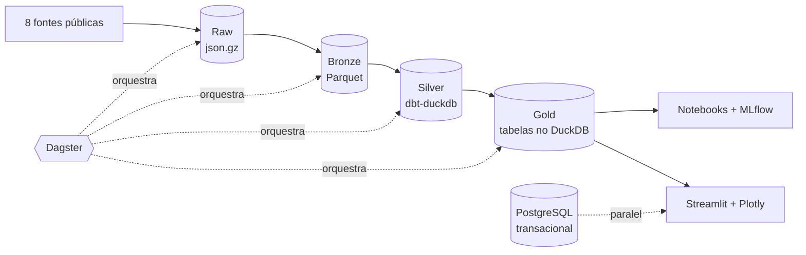

# Arquitetura Medallion

Organização progressiva do dado em quatro camadas: cada uma só lê da anterior, e a crua nunca é alterada. A regra vale para **todas** as fontes do repositório, do IPCA ao clima.

O PostgreSQL roda **em paralelo** a essa trilha, e não dentro dela: ele guarda o lado transacional, que tem escrita de usuário e não é dado derivado de origem pública. Medallion descreve o pipeline analítico.

## As quatro camadas

| Camada | Tecnologia | Papel |
|---|---|---|
| **Raw** | `.json.gz` (e `.html.gz` no DIEESE) em `data/raw/<fonte>/` | Resposta da origem exatamente como veio, comprimida e nunca reescrita |
| **Bronze** | Parquet em `data/parquet/<fonte>/` | Payload parseado e tipado, ainda por fonte, sem regra de negócio |
| **Silver** | Modelos `dbt-duckdb` em `models/staging/` | Modelagem e tratamento: limpeza, deduplicação, chaves resolvidas |
| **Gold** | Tabelas tratadas no DuckDB, a partir de `models/marts/` | Fato, dimensão e métricas — recorte pronto para painel e modelo |

## A trilha de cada fonte

| Fonte | Raw | Bronze |
|---|---|---|
| [IPCA/INPC (SIDRA)](../fontes/sidra.md) | `data/raw/ipca-inpc/{agregado}-{AAAAMM}.json.gz` | `data/parquet/ipca-inpc/` |
| [Commodities e Energia](../fontes/commodities.md) | `data/raw/commodities_raw/` | `data/parquet/*.parquet` |
| [Dólar Comercial](../fontes/dolar.md) | `data/raw/bcb/dolar_*.json.gz` | `data/parquet/bcb/` |
| [Taxa SELIC](../fontes/selic.md) | `data/raw/bcb/selic_*.json.gz` | `data/parquet/bcb/` |
| [PIB e Setores (SIDRA 1846)](../fontes/pib.md) | `data/raw/pib_raw/` (um JSON gzip por ano) | `data/parquet/pib/` |
| [PIB da China](../fontes/pib_china.md) | `data/raw/pib_china/` | `data/parquet/pib_china/` |
| [Salário Mínimo (DIEESE)](../fontes/salario_minimo.md) | `data/raw/dieese/salario_minimo_*.html.gz` | `data/parquet/dieese/` |
| [Dados do Clima (INMET)](../fontes/clima.md) | `data/raw/inmet/` | `data/parquet/clima/` |

Da Bronze para cima a trilha deixa de ser por fonte: as oito entram como *sources* do dbt e saem como um modelo dimensional só.

## O que cada passagem faz

**Origem → Raw** — nenhuma transformação. O ingestor grava a resposta comprimida antes de olhar para o conteúdo. É o que permite reprocessar tudo sem chamar a API de novo, e é a única cópia do HTML do DIEESE, cuja extração depende do layout da página.

**Raw → Bronze** — só parsing e tipagem: valor para numérico, período para data, cada origem com seu formato (`AAAAMM` no SIDRA, `DD/MM/YYYY` no SGS, `MM-DD-YYYY` no Olinda, ISO no resto; no DIEESE, a tabela HTML decodificada em `ISO-8859-1`). Cada linha sai com a data de ingestão e o arquivo de origem. Nenhuma regra de negócio entra aqui.

**Bronze → Silver** — é onde o dbt trabalha. Um modelo de *staging* por fonte, que assume o tratamento:

- **Marcadores de ausência:** o SIDRA usa `...`, `..`, `-` e `X`, e a Alpha Vantage usa `.`; todos são descartados, sem apagar valores negativos, que são deflação.
- **Deduplicação:** quando a origem devolve mais de um registro para a mesma data, fica o mais recente (no Olinda, o maior `dataHoraCotacao`).
- **Calendário civil:** nas séries diárias, a última observação útil é esticada sobre fins de semana e feriados, e a coluna `observado` distingue publicação real de valor preenchido.
- **Atributos derivados:** razões que sempre acompanham o fato, como `multiplo_necessario_nominal` no salário mínimo.
- **Testes na própria transformação:** esquema, unicidade, integridade referencial, volume e ao menos um de distribuição.

**Silver → Gold** — cruzamento e recorte, em tabelas materializadas no DuckDB: fato com granularidade declarada, dimensão de variação lenta para a cesta do IPCA, transposição para formato largo nas features e a matriz de treino dos modelos.

## Gold: o que a camada entrega

| Tabela | Grão | Serve a |
|---|---|---|
| Fato do IPCA/INPC | uma linha por subitem, por localidade, por mês | painel e alvo do modelo |
| Dimensão da cesta | uma linha por código, por vigência (variação lenta) | resolver o nome vigente sob renomeação |
| Dimensão de localidade | uma linha por localidade medida pelo IPCA | recorte por praça |
| Features macro | uma linha por mês, colunas por série | treino e explicação |
| Matriz de treino | uma linha por mês, alvo + features defasadas | notebooks e MLflow |

## Qualidade

- **Testes do dbt** em cada camada, dentro da transformação: esquema, volume, unicidade, integridade referencial e distribuição. Substituem a verificação ad-hoc que hoje vive em `sql/verificar_carga.sql`.
- **Linhagem** gerada por `dbt docs generate`: o grafo mostra de qual Parquet cada tabela da Gold descende.
- **Freshness** declarada por *source*, com SLA para as tabelas de consumo.
- **Falha explícita em vez de sucesso falso:** payload inesperado, layout HTML alterado, resposta vazia ou data inválida encerram a etapa com código diferente de zero, e o Dagster marca o ativo como não atualizado.
- **Idempotência:** rodar a mesma janela cem vezes converge para o mesmo estado, na Raw (nome de arquivo por janela) e na Silver (modelo reconstruído a partir da Bronze).
