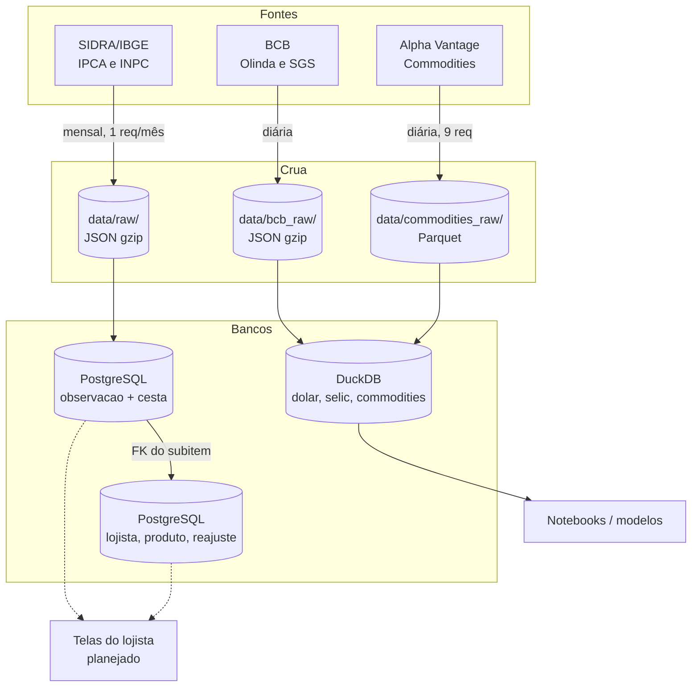

# Fluxo de Dados

Da fonte até a tela do lojista. Detalhe das etapas em [Pipeline de Dados](../pipeline/pipelineDados.md).

## Caminho do IPCA

1. **Extração:** `sidra.py` pede um mês por requisição à API de valores (teto de 50.000 valores) e os nomes da cesta à API de metadados.
2. **Aterrissagem:** a resposta vai crua para `data/raw/{agregado}-{AAAAMM}.json.gz`, antes de qualquer transformação.
3. **Carga:** `ingest.py` descarta ausências, traduz o id interno do SIDRA para o código da cesta e insere em `observacao` (insert-only, idempotente).
4. **Consumo:** as perguntas do lojista leem `observacao` junto com `classificacao_versao` (nome vigente) e `produto` (FK do subitem).

## Cadência

| Fonte | Chega | Destino | Gatilho hoje |
|---|---|---|---|
| SIDRA (7060, 7063, 1737) | mensal, dias 9 a 12 | PostgreSQL | manual (`uv run python -m inflatrack.ingest`) |
| SIDRA (2938, 1419) | nunca mais (séries encerradas) | PostgreSQL | só na carga histórica (`just seed`) |
| BCB (Olinda e SGS) | diária (dias úteis) | DuckDB | manual (`just seed-macro`) |
| Alpha Vantage | diária / mensal | DuckDB | manual (`just seed-macro`) |