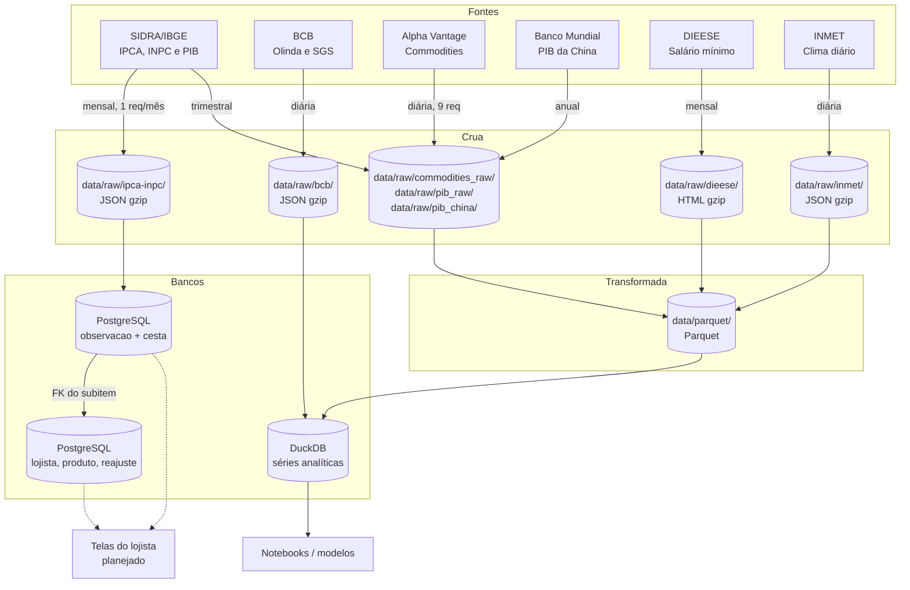

# Fluxo de Dados

Da fonte até a tela do lojista. Detalhe das etapas em [Pipeline de Dados](../pipeline/pipelineDados.md).

```mermaid
flowchart TB
    subgraph Fontes
        S[SIDRA/IBGE<br/>IPCA, INPC e PIB]
        BCB[BCB<br/>Olinda e SGS]
        AV[Alpha Vantage<br/>Commodities]
        WB[Banco Mundial<br/>PIB da China]
        DI[DIEESE<br/>Salário mínimo]
        IN[INMET<br/>Clima diário]
    end
    subgraph Crua
        R1[(data/raw/ipca-inpc/<br/>JSON gzip)]
        R2[(data/raw/commodities_raw/<br/>data/raw/pib_raw/<br/>data/raw/pib_china/)]
        R3[(data/raw/bcb/<br/>JSON gzip)]
        R4[(data/raw/dieese/<br/>HTML gzip)]
        R5[(data/raw/inmet/<br/>JSON gzip)]
    end
    subgraph Transformada
        PQ[(data/parquet/<br/>Parquet)]
    end
    subgraph Bancos
        PG[(PostgreSQL<br/>observacao + cesta)]
        TX[(PostgreSQL<br/>lojista, produto, reajuste)]
        DK[(DuckDB<br/>séries analíticas)]
    end
    S -->|mensal, 1 req/mês| R1 --> PG
    S -->|trimestral| R2
    BCB -->|diária| R3 --> DK
    AV -->|diária, 9 req| R2
    WB -->|anual| R2
    DI -->|mensal| R4 --> PQ
    IN -->|diária| R5 --> PQ
    R2 --> PQ --> DK
    PG -->|FK do subitem| TX
    PG -.-> V[Telas do lojista<br/>planejado]
    TX -.-> V
    DK --> ML[Notebooks / modelos]
```

## Caminho do IPCA

1. **Extração:** `sidra.py` pede um mês por requisição à API de valores (teto de 50.000 valores) e os nomes da cesta à API de metadados.
2. **Aterrissagem:** a resposta vai crua para `data/raw/ipca-inpc/{agregado}-{AAAAMM}.json.gz`, antes de qualquer transformação.
3. **Carga:** `ingest.py` descarta ausências, traduz o id interno do SIDRA para o código da cesta e insere em `observacao` (insert-only, idempotente).
4. **Consumo:** as perguntas do lojista leem `observacao` junto com `classificacao_versao` (nome vigente) e `produto` (FK do subitem).

## Caminho das fontes analíticas

O padrão é o mesmo para todas as séries que terminam no DuckDB, e está descrito em [Componentes](componentes.md):

1. **Extração:** o módulo de cliente (`alphavantage.py`, `dolar_olinda.py`, `selic_sgs.py`, `pib.py`, `dieese.py`, `inmet.py`) fala com uma origem só e devolve o payload sem interpretá-lo.
2. **Aterrissagem e transformação:** o `ingest_*.py` grava a resposta crua comprimida e materializa o resultado tratado — em Parquet nas fontes com volume, em memória nas séries diárias do Banco Central.
3. **Carga:** o `load_*.py` aplica o esquema de `scripts/setup_duckdb*.sql` e faz `UPSERT` por chave natural de data no arquivo único `data/duckdb/inflatrack.duckdb`.
4. **Consumo:** as views de features (`vw_features_*`, `vw_pib_*`) cruzam as séries entre si para os modelos.

## Cadência

| Fonte | Chega | Destino | Gatilho hoje |
|---|---|---|---|
| SIDRA (7060, 7063, 1737) | mensal, dias 9 a 12 | PostgreSQL | manual (`uv run python -m inflatrack.ingest`) |
| SIDRA (2938, 1419) | nunca mais (séries encerradas) | PostgreSQL | só na carga histórica (`just seed`) |
| SIDRA 1846 (PIB e setores) | trimestral | DuckDB | manual (`just pib`) |
| BCB (Olinda e SGS) | diária (dias úteis) | DuckDB | manual (`just seed-macro`) |
| Alpha Vantage | diária / mensal | DuckDB | manual (`just seed-macro`) |
| Banco Mundial (PIB da China) | anual | DuckDB | manual (`just pib-china`) |
| DIEESE (salário mínimo) | mensal | DuckDB | manual (`just salario-minimo`) |
| INMET (clima e estações) | diária | DuckDB | manual (`just clima`) |

!!! note "Escritor único no DuckDB"
    O DuckDB aceita um escritor por vez no arquivo, então as cargas analíticas rodam em sequência, nunca em paralelo — é o que `just seed-macro` faz ao encadear dólar, Selic e commodities.
