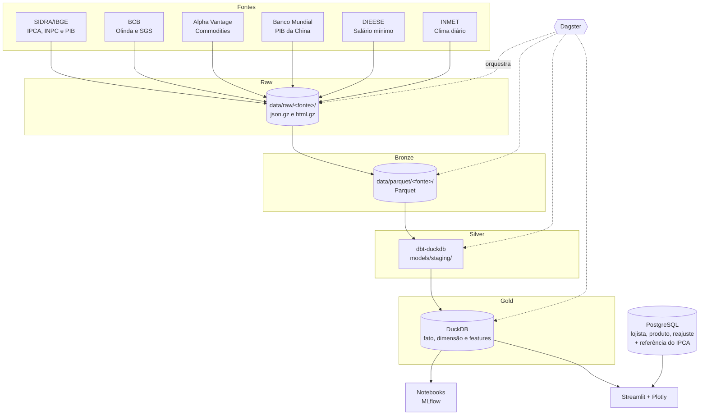

# Fluxo de Dados

Da fonte até a tela do lojista. As camadas estão em [Arquitetura Medallion](arquiteturaMedallion.md), as peças em [Componentes](componentes.md) e o detalhe de cada etapa em [Contrato das Etapas](../pipeline/contratoEtapas.md).

```mermaid
flowchart TB
    subgraph Fontes
        S[SIDRA/IBGE<br/>IPCA, INPC e PIB]
        BCB[BCB<br/>Olinda e SGS]
        AV[Alpha Vantage<br/>Commodities]
        WB[Banco Mundial<br/>PIB da China]
        DI[DIEESE<br/>Salário mínimo]
        IN[INMET<br/>Clima diário]
    end
    subgraph Raw
        R[(data/raw/&lt;fonte&gt;/<br/>json.gz e html.gz)]
    end
    subgraph Bronze
        B[(data/parquet/&lt;fonte&gt;/<br/>Parquet)]
    end
    subgraph Silver
        SV[dbt-duckdb<br/>models/staging/]
    end
    subgraph Gold
        G[(DuckDB<br/>fato, dimensão e features)]
    end
    S & BCB & AV & WB & DI & IN --> R --> B --> SV --> G
    G --> NB[Notebooks<br/>MLflow]
    G --> ST[Streamlit + Plotly]
    PG[(PostgreSQL<br/>lojista, produto, reajuste<br/>+ referência do IPCA)] --> ST
    DG{{Dagster}} -.orquestra.-> R
    DG -.-> B
    DG -.-> SV
    DG -.-> G
```

## O percurso, etapa por etapa

1. **Extração** — o cliente de origem (`sidra.py`, `alphavantage.py`, `dolar_olinda.py`, `selic_sgs.py`, `pib.py`, `dieese.py`, `inmet.py`) fala com uma origem só e devolve o payload sem interpretá-lo.
2. **Raw** — o ingestor grava a resposta comprimida em `data/raw/<fonte>/`, antes de qualquer transformação.
3. **Bronze** — o mesmo ingestor parseia e tipa, e materializa Parquet em `data/parquet/<fonte>/`, com data de ingestão e procedência em cada linha.
4. **Silver** — o dbt lê o Parquet como *source* e constrói um modelo de staging por fonte: limpeza, deduplicação, calendário civil, chaves resolvidas, tudo testado na própria transformação.
5. **Gold** — os modelos de *marts* materializam no DuckDB o fato do IPCA, a dimensão de variação lenta da cesta, as features macro e a matriz de treino.
6. **Consumo** — notebooks treinam e comparam modelos, com MLflow registrando cada execução; o painel Streamlit responde às cinco perguntas de gestão.

Em paralelo, o **PostgreSQL** atende o lado transacional: cadastro de lojista e produto, e a aplicação de reajuste, que é a única escrita que exige transação. É de lá que vem a FK `produto.codigo_subitem_ipca`, a ponte entre o catálogo do lojista e a cesta do IBGE.

## Cadência

| Fonte | Chega | Partição | Gatilho hoje |
|---|---|---|---|
| SIDRA (7060, 7063, 1737) | mensal, dias 9 a 12 | mensal | manual (`uv run python -m inflatrack.ingest`) |
| SIDRA (2938, 1419) | nunca mais (séries encerradas) | — | só na carga histórica (`just seed`) |
| SIDRA 1846 (PIB e setores) | trimestral | trimestral | manual (`just pib`) |
| BCB (Olinda e SGS) | diária (dias úteis) | diária | manual (`just seed-macro`) |
| Alpha Vantage | diária / mensal | diária | manual (`just seed-macro`) |
| Banco Mundial (PIB da China) | anual | anual | manual (`just pib-china`) |
| DIEESE (salário mínimo) | mensal | mensal | manual (`just salario-minimo`) |
| INMET (clima e estações) | diária | diária | manual (`just clima`) |

O gatilho manual é transitório: com o Dagster, cada linha acima vira um ativo particionado, com retry por partição e backfill da janela histórica.

!!! note "Escritor único no DuckDB"
    O DuckDB aceita um escritor por arquivo, por vez. Isso vale para os três processos que tocam o banco: a carga, o `dbt build` e o painel. O Dagster serializa as escritas, e o Streamlit lê uma cópia publicada da Gold em vez do arquivo em construção.
