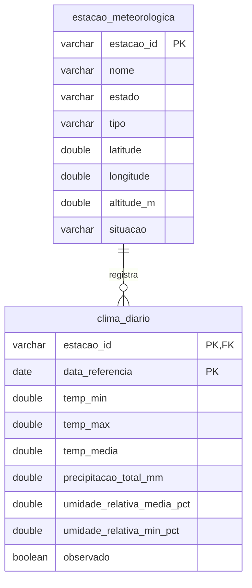

# Dados do Clima Diário (INMET) — Dicionário de Dados

## Contexto

Esta seção detalha o schema físico dos dados meteorológicos coletados pela rede de estações do Instituto Nacional de Meteorologia (INMET), armazenados no banco analítico compartilhado (**DuckDB** em `data/duckdb/inflatrack.duckdb`), em conformidade com o [ADR 0002](../adr/0002-duckdb-unico.md).

As medições climáticas funcionam como variáveis explicativas e antecedentes para modelos de machine learning, permitindo identificar quebras de safra, secas severas ou geadas que afetam as cotações de commodities agrícolas (`commodity_cotacao`) e o subgrupo de Alimentação e Bebidas do IPCA.

---

## Modelo Conceitual

O modelo meteorológico adota a separação dimensional clássica entre o cadastro cadastral das estações e as medições temporais diárias:



---

## Entidades

### Tabela: `estacao_meteorologica`

Dimensão cadastral que registra os metadados e coordenadas geográficas de cada estação da malha nacional do INMET.

| Coluna | Tipo (DuckDB) | Chave | Descrição |
|---|---|---|---|
| `estacao_id` | `VARCHAR(10)` | PK | Código identificador único da estação cadastrado no INMET/OMM (ex.: `A001`, `A472`). |
| `nome` | `VARCHAR` | | Nome da localidade ou município onde a estação está instalada (ex.: `BRASILIA`, `ACAJUTIBA`). |
| `estado` | `VARCHAR(2)` | | Sigla da Unidade Federativa (UF) da estação (ex.: `DF`, `BA`, `MT`, `PR`). |
| `tipo` | `VARCHAR(20)` | | Tipo de operação: `Automatica` (digital com telemetria contínua) ou `Convencional` (analógica manual). |
| `latitude` | `DOUBLE` | | Latitude geográfica em graus decimais (WGS 84). |
| `longitude` | `DOUBLE` | | Longitude geográfica em graus decimais (WGS 84). |
| `altitude_m` | `DOUBLE` | | Altitude do ponto de coleta em relação ao nível do mar (em metros). |
| `situacao` | `VARCHAR(20)` | | Situação operacional da estação no momento da sincronização (`Operante`, `Pane`). |

### Tabela: `clima_diario`

Tabela de fato com granularidade diária por estação, acumulando medições de temperatura, chuva e umidade.

| Coluna | Tipo (DuckDB) | Chave | Descrição |
|---|---|---|---|
| `estacao_id` | `VARCHAR(10)` | PK, FK | Código da estação meteorológica de origem (FK para `estacao_meteorologica.estacao_id`). |
| `data_referencia` | `DATE` | PK | Data civil da medição consolidada (`YYYY-MM-DD`). |
| `temp_min` | `DOUBLE` | | Temperatura mínima registrada no dia (em °C). |
| `temp_max` | `DOUBLE` | | Temperatura máxima registrada no dia (em °C). |
| `temp_media` | `DOUBLE` | | Temperatura média diária apurada (em °C). |
| `precipitacao_total_mm` | `DOUBLE` | | Volume acumulado de chuva no dia (em milímetros). |
| `umidade_relativa_media_pct` | `DOUBLE` | | Umidade relativa do ar média observada no dia (em %). |
| `umidade_relativa_min_pct` | `DOUBLE` | | Menor nível de umidade relativa registrado no dia (em %). |
| `observado` | `BOOLEAN` | | `true` se coletado diretamente dos sensores; `false` se preenchido/imputado por interpolação regional. |

---

## Consultas de Exemplo

### 1. Precipitação Acumulada nos Últimos 30 Dias nos Cinturões Produtores

```sql
SELECT 
    e.estado,
    e.nome AS estacao,
    round(sum(c.precipitacao_total_mm), 1) AS chuva_acumulada_30d_mm,
    round(avg(c.temp_media), 1) AS temp_media_30d_c
FROM clima_diario c
JOIN estacao_meteorologica e ON e.estacao_id = c.estacao_id
WHERE e.estado IN ('MT', 'GO', 'MS', 'PR')
  AND c.data_referencia >= CURRENT_DATE - INTERVAL 30 DAYS
GROUP BY e.estado, e.nome
ORDER BY chuva_acumulada_30d_mm ASC;
```

### 2. Cruzamento de Choques Climáticos com Preço de Commodities Agrícolas

Avalia a relação entre secas ou geadas e as cotações de milho, café ou trigo:

```sql
SELECT 
    c.data_referencia,
    round(avg(c.precipitacao_total_mm), 2) AS media_chuva_brasil_mm,
    round(min(c.temp_min), 1) AS temperatura_minima_nacional_c,
    p.preco AS preco_milho_usd
FROM clima_diario c
JOIN commodity_cotacao p ON p.data_referencia = c.data_referencia AND p.symbol = 'CORN'
WHERE c.data_referencia >= '2024-01-01'
GROUP BY c.data_referencia, p.preco
ORDER BY c.data_referencia DESC;
```
