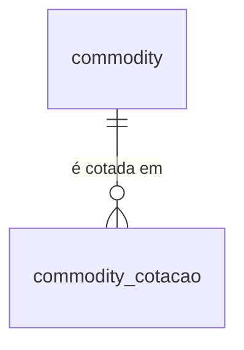

# Commodities e Energia (Alpha Vantage) — Dicionário de Dados

## Contexto

Tabelas que recebem as séries de preço de energia e agrícolas da Alpha Vantage. Esquema definido em `scripts/setup_duckdb.sql`; as linhas vêm de `src/inflatrack/load_commodities.py`, a partir dos Parquet gerados por `src/inflatrack/ingest_commodities.py`.

Vive no `data/duckdb/inflatrack.duckdb`, o mesmo arquivo do PIB e das séries do Banco Central — ver [ADR 0002](../adr/0002-duckdb-unico.md).

Três decisões moldam o esquema:

- **A dimensão é semeada em código, não pelo Parquet.** `commodity` é populada por UPSERT a partir do dicionário `COMMODITY_CONFIGS`, duplicado em `ingest_commodities.py` e `load_commodities.py`. O Parquet carrega só `(symbol, data_referencia, preco)` — nome, categoria e unidade não trafegam por ele.
- **`commodity_cotacao` é UPSERT, não insert-only.** Oposto de `observacao` no [IPCA](sidra.md): a origem devolve sempre a série inteira, e o valor mais recente da API é o que vale. Recarregar sobrescreve em vez de duplicar.
- **A unidade vive na dimensão, não no fato.** `preco` é um `DOUBLE` sem unidade: USD/barril no WTI, centavos/libra no café, índice no `ALL_COMMODITIES`. Sem o `join` com `commodity.unit`, comparar dois símbolos entre si não tem significado.

!!! info "Sem dado pessoal"
    Preços de ativos negociados em bolsa e índices agregados. Nenhuma pessoa é identificável.

!!! warning "Símbolos com frequências diferentes na mesma tabela"
    `WTI`, `BRENT` e `NATURAL_GAS` são diárias; as outras seis são mensais, gravadas sempre no **dia 1** do mês. Um `SELECT` sem filtro por símbolo devolve as duas granularidades misturadas, e um `avg(preco)` por mês pesaria ~21 observações de petróleo contra 1 de café.

## Modelo Conceitual



Uma dimensão e um fato, sem dimensão de calendário: a data é atributo da própria cotação. Não há localidade — os preços são internacionais, em dólar.

## Entidades

### commodity

Dimensão: os 9 ativos coletados. Populada por UPSERT na carga, a partir de `COMMODITY_CONFIGS`.

| Campo | Tipo | Descrição |
|---|---|---|
| `symbol` | VARCHAR (PK) | Código do ativo, igual ao nome da `function` na API da Alpha Vantage (ex.: `WTI`, `COFFEE`) |
| `name` | VARCHAR | Nome em português, para exibição (ex.: `Petróleo Brent`) |
| `category` | VARCHAR | `Energia` (3), `Agrícola` (5) ou `Geral` (1) |
| `unit` | VARCHAR | Unidade do `preco` — sem ela o número não é interpretável |

Os 9 símbolos, como estão no banco:

| `symbol` | `name` | `category` | `unit` | Frequência |
|---|---|---|---|---|
| `WTI` | Petróleo WTI | Energia | `USD/barrel` | Diária |
| `BRENT` | Petróleo Brent | Energia | `USD/barrel` | Diária |
| `NATURAL_GAS` | Gás Natural | Energia | `USD/MMBtu` | Diária |
| `WHEAT` | Trigo | Agrícola | `USD/metric ton` | Mensal |
| `CORN` | Milho | Agrícola | `USD/metric ton` | Mensal |
| `COTTON` | Algodão | Agrícola | `USD/metric ton` | Mensal |
| `SUGAR` | Açúcar | Agrícola | `cents/pound` | Mensal |
| `COFFEE` | Café | Agrícola | `cents/pound` | Mensal |
| `ALL_COMMODITIES` | Índice Global | Geral | `index (2016=100)` | Mensal |

A `category` não é usada por nenhuma view; serve para agrupar em consulta ad hoc e para separar energia de agrícola na leitura.

### commodity_cotacao

Tabela de fato: o preço de fechamento de um ativo numa data. 26.781 linhas na carga de referência.

| Campo | Tipo | Descrição |
|---|---|---|
| `symbol` | VARCHAR (PK, FK `commodity`) | Ativo cotado |
| `data_referencia` | DATE (PK) | Data do fechamento nas séries diárias; **primeiro dia do mês** nas mensais |
| `preco` | DOUBLE | Preço na unidade de `commodity.unit`. `NOT NULL` — dia sem cotação simplesmente não tem linha |

Chave primária `(symbol, data_referencia)`. É ela que torna a carga idempotente: recarregar o histórico completo sobrescreve os preços em vez de duplicar.

Cobertura por símbolo na carga de referência:

| `symbol` | Linhas | Início | Fim |
|---|---|---|---|
| `WTI` | 9.507 | 1986-01-02 | 2026-09-22 |
| `BRENT` | 9.092 | 1987-05-20 | 2026-09-22 |
| `NATURAL_GAS` | 5.692 | 1997-01-07 | 2026-09-22 |
| `ALL_COMMODITIES`, `COFFEE`, `CORN`, `COTTON`, `SUGAR`, `WHEAT` | 415 cada | 1992-01-01 | 2026-07-01 |

!!! danger "Ausência aqui é linha faltando, não `NULL`"
    Diferente de `dolar_cotacao` e `selic_taxa` (ver [Macroeconomia](macroeconomia.md)), esta tabela **não** tem preenchimento de calendário nem coluna `observado`. Fins de semana, feriados e os valores `.` devolvidos pela origem são descartados na ingestão. Um `JOIN` de uma venda de sábado com `commodity_cotacao` perde a linha silenciosamente; para essas datas é preciso repetir o último valor na consulta, com um `LEFT JOIN LATERAL` que pega a cotação anterior mais próxima.

## Views

Duas views de *feature*, ambas em formato largo (uma coluna por símbolo), produzidas por `PIVOT ... USING avg(preco)`. Existem para alimentar modelo sem exigir pivotagem no cliente, e são o espelho de `vw_features_pib_trimestral` no [PIB](pib.md).

### vw_features_daily

Uma linha por dia com cotação de energia. Só os dias úteis aparecem.

| Campo | Tipo | Descrição |
|---|---|---|
| `data_referencia` | DATE | Data do fechamento |
| `WTI`, `BRENT`, `NATURAL_GAS` | DOUBLE | Preço do dia, na unidade de cada símbolo. `NULL` quando aquele símbolo não teve cotação no dia |

### vw_features_monthly

Uma linha por mês, sempre no dia 1, com as séries agrícolas e o índice global.

| Campo | Tipo | Descrição |
|---|---|---|
| `data_referencia` | DATE | Primeiro dia do mês |
| `WHEAT`, `CORN`, `COTTON`, `SUGAR`, `COFFEE`, `ALL_COMMODITIES` | DOUBLE | Preço do mês, na unidade de cada símbolo |

!!! note "O `avg` do PIVOT não agrega nada, e a lista de colunas é manual"
    Como `(symbol, data_referencia)` é único na tabela de fato, cada célula do PIVOT tem no máximo um valor: o `avg` é exigência de sintaxe do `PIVOT`, não uma média de verdade. Se a granularidade da tabela mudar, ele passa a mediar de fato — e a mudança não daria erro nenhum.

    Os nomes das colunas vêm do valor de `symbol`, em maiúsculas. Acrescentar um símbolo novo à tabela **não** o faz aparecer na view: a lista está escrita nos dois `IN (...)` de `scripts/setup_duckdb.sql` e precisa ser editada à mão.

## Camadas anteriores

O DuckDB é a camada servida. Antes dele:

| Camada | Caminho | Formato |
|---|---|---|
| Bruta | `data/raw/commodities_raw/<symbol>_<modo>.json.gz` | Resposta da API exatamente como veio, em gzip |
| Transformada | `data/parquet/<symbol>_<modo>.parquet` | Parquet, um por símbolo |

`<modo>` é `historico` ou `incremental`, do argumento `--modo`. Como a origem não aceita filtro por data, os dois modos baixam a série completa; o nome só distingue os arquivos.

Campos do JSON bruto da Alpha Vantage:

| Campo | Descrição |
|---|---|
| `name`, `interval`, `unit` | Metadados da série. **Não são carregados** — a unidade usada no banco vem de `COMMODITY_CONFIGS`, não daqui |
| `data[].date` | Data `AAAA-MM-DD`; vira `data_referencia` |
| `data[].value` | Preço como **string**. `"."` é marcador de ausência e é descartado em `process_response` |

O Parquet já é exatamente o esquema de `commodity_cotacao`: `(symbol, data_referencia, preco)`.

!!! note "O glob da carga é raso e presume esse esquema"
    `load_commodities.py` lê `data/parquet/*.parquet` e faz `SELECT symbol, data_referencia, preco`. Qualquer Parquet de outra fonte solto na raiz de `data/parquet/` quebra a carga — é por isso que o PIB e o PIB da China gravam em subpasta.

## Exemplos de Uso

```sql
-- Últimos fechamentos de energia, com a unidade que dá sentido ao número.
select c.data_referencia, d.name, c.preco, d.unit
from commodity_cotacao c
join commodity d on d.symbol = c.symbol
where d.category = 'Energia'
  and c.data_referencia = (select max(data_referencia) from commodity_cotacao where symbol = 'WTI')
order by d.name;

-- Variação de 12 meses do café: a série é mensal, então o lag é de 12 linhas do próprio símbolo.
select data_referencia,
       preco,
       100.0 * (preco / lag(preco, 12) over (order by data_referencia) - 1) as var_anual_pct
from commodity_cotacao
where symbol = 'COFFEE'
order by data_referencia desc
limit 12;

-- Matriz de features diária para o modelo. Só dias úteis: a view não preenche calendário.
select * from vw_features_daily
where data_referencia >= date '2026-01-01'
order by data_referencia desc;

-- Repasse do câmbio: Brent em dólar x Brent em real, cruzando com a série do BCB.
-- O LEFT JOIN LATERAL cobre o fim de semana, em que não há cotação de petróleo.
select d.data_referencia, d.cotacao_venda, b.preco as brent_usd, b.preco * d.cotacao_venda as brent_brl
from dolar_cotacao d
left join lateral (
    select preco from commodity_cotacao
    where symbol = 'BRENT' and data_referencia <= d.data_referencia
    order by data_referencia desc
    limit 1
) b on true
where d.data_referencia >= date '2026-01-01'
order by d.data_referencia desc;
```

## Referências

- [Documentação de Commodities da Alpha Vantage](https://www.alphavantage.co/documentation/#commodities)
- Esquema: `scripts/setup_duckdb.sql`
- Caracterização da origem: [Commodities e Energia](../fontes/commodities.md)
- Decisão do banco: [ADR 0002 — DuckDB único](../adr/0002-duckdb-unico.md)
