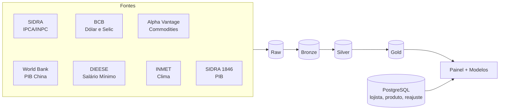

# Dicionário de Dados

## Visão Geral

O dicionário do InflaTrack descreve os dados integrados em dois níveis complementares: uma **visão conceitual** aqui no MkDocs e a **implementação física** gerada pelo dbt docs.

| Nível | Onde | O que traz |
|---|---|---|
| **Conceitual (MkDocs)** | uma página por fonte | entidades, relacionamentos, exemplos de uso |
| **Físico (dbt docs)** | `dbt docs generate` | colunas, tipos, testes e linhagem por model |

## Organização por Camada

O dado percorre quatro camadas ([Arquitetura Medallion](../arquitetura/arquiteturaMedallion.md)):

1. **Raw** (`.json.gz` / `.html.gz`): resposta da origem, nunca reescrita
2. **Bronze** (Parquet): payload parseado e tipado, ainda por fonte
3. **Silver** (dbt-duckdb): limpeza, deduplicação e chaves resolvidas
4. **Gold** (DuckDB): fatos, dimensões e features prontos para análise

O **PostgreSQL** roda em paralelo, com o lado transacional do lojista.

## Fontes → Tabelas

| Fonte | Tabelas | Banco |
|---|---|---|
| [SIDRA/IBGE (IPCA e INPC)](sidra.md) | `fonte_agregado`, `variavel`, `localidade`, `classificacao`, `classificacao_versao`, `observacao` | PostgreSQL |
| [Transacional (Lojista)](transacional.md) | `lojista`, `produto`, `reajuste` | PostgreSQL |
| [PIB e Setores (SIDRA 1846)](pib.md) | `pib_setor`, `pib_valor` | DuckDB |
| [PIB da China (World Bank)](pib_china.md) | `pib_china` | DuckDB |
| [Macroeconomia (Dólar, Selic)](macroeconomia.md) | `dolar_cotacao`, `selic_taxa` | DuckDB |
| [Commodities e Energia (Alpha Vantage)](commodities.md) | `commodity`, `commodity_cotacao` | DuckDB |
| [Salário Mínimo (DIEESE)](salario_minimo.md) | `salario_minimo` | DuckDB |
| [Dados do Clima (INMET)](clima.md) | `estacao_meteorologica`, `clima_diario` | DuckDB |

A caracterização da origem (volume, frequência, restrições) fica em [Fonte de Dados](../arquitetura/fonteDados.md).

## Dimensões Compartilhadas

- **Tempo** — o mês de referência é a chave que junta IPCA, macroeconomia, PIB, salário mínimo e clima agregado
- **Cesta do IPCA** — código do subitem com vigência de nome, resolvido por `classificacao_versao`
- **Localidade** — praças medidas pelo IPCA, usadas para recorte regional

## Exemplos de Uso (Gold)

- **Variação do subitem por praça**: série mensal do IPCA por subitem e localidade, para sugerir reajuste por produto
- **Features macro defasadas**: dólar, Selic e commodities em colunas por mês, alinhados ao alvo do modelo
- **Clima × alimentos**: medições do INMET cruzadas com o subgrupo de Alimentação e Bebidas

## dbt docs

O esquema físico completo — colunas, tipos, testes e linhagem de cada model — é gerado por `dbt docs generate` e servido por `dbt docs serve`.
