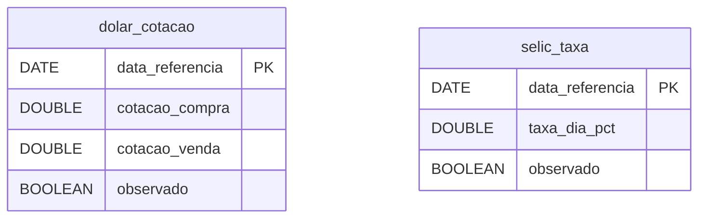

# Macroeconomia (Dólar e Selic) — Dicionário de Dados

## Contexto

Tabelas que recebem as duas séries diárias do Banco Central: a cotação do dólar comercial (PTAX, API Olinda) e a taxa Selic efetiva (série 11 do SGS). Esquema definido em `scripts/setup_duckdb_macro.sql`, aplicado pela própria carga; as linhas vêm de `src/inflatrack/ingest_dolar.py` e `src/inflatrack/ingest_selic.py` — ver [ADR 0003](../adr/0003-bcb-macro.md).

Ficam no `data/duckdb/inflatrack.duckdb`, o mesmo arquivo das commodities e dos dois PIBs ([ADR 0002](../adr/0002-duckdb-unico.md)). Diferente da modelagem relacional transacional, que fragmenta o dado em tabelas normalizadas, a modelagem colunar aqui mantém tabelas largas e contínuas, otimizadas para ler milhares de dias de série temporal de uma vez.

Duas decisões moldam o esquema, e são as mesmas nas duas tabelas:

- **Ingestão e carga no mesmo passo.** Ao contrário das commodities e dos PIBs, estas duas fontes não têm camada Parquet: `ingest_dolar` e `ingest_selic` gravam o JSON bruto e escrevem direto no DuckDB. A série é pequena e a transformação é uma só (preencher o calendário), então uma camada intermediária não pagaria o próprio custo.
- **O calendário é civil, não bancário.** As duas origens publicam só em dia útil. A ingestão reindexa a série no calendário completo (`pd.date_range(..., freq="D")`) e repete o último valor conhecido (`ffill`), para que um `join` com uma venda de sábado não perca a linha. `observado` é o que distingue o valor publicado do valor esticado — sem ela, o preenchimento seria indistinguível do dado real.

!!! info "Sem dado pessoal"
    Cotação de referência e taxa de juros oficiais, ambas agregados nacionais. Nenhuma pessoa é identificável.

!!! warning "Metade das linhas não é dado publicado"
    Com fins de semana e feriados bancários, cerca de 30% a 35% das linhas de cada tabela têm `observado = false`: são repetições do último dia útil. Qualquer média, desvio ou contagem que não filtre por `observado = true` sobrepesa segundas-feiras e véspera de feriado. Para estatística da série, filtre; para `join` com evento diário (venda, reajuste), não filtre — é justamente para isso que a linha existe.

## Modelo Conceitual



Duas tabelas independentes, sem dimensão e sem FK entre si. A relação é temporal: ambas são indexadas pelo mesmo calendário civil e se cruzam por `data_referencia`, o que também as liga a `commodity_cotacao` (ver [Commodities](commodities.md)).

## Entidades

### dolar_cotacao

Cotação oficial diária (PTAX) do dólar comercial americano. Uma linha por dia civil do período carregado.

| Campo | Tipo | Chave | Descrição |
|---|---|---|---|
| `data_referencia` | DATE | PK | Data de referência. Fim de semana e feriado recebem a última cotação útil conhecida |
| `cotacao_compra` | DOUBLE | | Preço pago pelo banco na compra de dólares, em reais. `NOT NULL` |
| `cotacao_venda` | DOUBLE | | Preço cobrado pelo banco na venda de dólares, em reais. `NOT NULL` — é a coluna usada para converter preço internacional em real |
| `observado` | BOOLEAN | | `true` quando houve boletim publicado para a data; `false` quando o valor foi repetido do dia útil anterior |

Chave primária `data_referencia`, com UPSERT nas três colunas. É ela que torna a carga idempotente e, mais que isso, **corrigível**: rodar a carga antes do fechamento do câmbio grava o último boletim disponível com `observado = true`, e a rodada seguinte substitui o valor pelo de fechamento.

O intervalo carregado vem dos argumentos `--de` (padrão `2020-01-01`) e `--ate` (padrão: hoje). A busca na origem recua 10 dias além de `--de`, para que exista valor anterior com que preencher o início do período.

!!! note "A origem devolve vários boletins por dia"
    O recurso `CotacaoDolarPeriodo` publica abertura, boletins intermediários e fechamento. `transformar` ordena por `dataHoraCotacao` e mantém o **último** de cada dia — sem essa deduplicação a tabela ganharia linhas conflitantes para a mesma data. A hora do boletim não é preservada: só a data entra no banco.

### selic_taxa

Taxa básica de juros **efetiva diária** apurada pelo Banco Central (série 11 do SGS). Uma linha por dia civil do período carregado.

| Campo | Tipo | Chave | Descrição |
|---|---|---|---|
| `data_referencia` | DATE | PK | Data de referência. Fim de semana e feriado recebem o último valor útil conhecido |
| `taxa_dia_pct` | DOUBLE | | Taxa Selic efetiva da série 11, em **percentual ao dia** (ordem de grandeza: `0,05`). `NOT NULL` |
| `observado` | BOOLEAN | | `true` quando a taxa foi publicada para a data; `false` quando foi repetida do dia útil anterior |

Chave primária `data_referencia`, com UPSERT — mesma mecânica do dólar, e pelo mesmo motivo: o SGS publica a taxa de um dia útil só no dia útil seguinte, então o dia mais recente nasce `observado = false` e é corrigido na rodada seguinte.

!!! danger "A taxa é ao dia, e anualizar é composição"
    `taxa_dia_pct` não é a Selic de que se fala no noticiário. Para chegar à taxa anual equivalente é preciso compor sobre os dias úteis do ano — `(1 + taxa_dia_pct/100) ^ 252 - 1` — e não multiplicar por 252 nem por 365. A conversão **não** é feita na ingestão, e o número de dias úteis é 252 por convenção do mercado, não por contagem do calendário carregado.

    Esta é a Selic **efetiva**, não a **meta** definida pelo Copom. Quem precisar da meta tem de coletar a série 432 do SGS, que não é ingerida hoje.

## Views

Nenhuma. Ao contrário das commodities (`vw_features_daily`) e do PIB (`vw_features_pib_trimestral`), estas duas séries já estão em formato largo, com uma linha por dia e o calendário completo: não há o que pivotar nem lacuna a cobrir. O cruzamento entre elas e com as demais fontes é um `join` direto por `data_referencia`.

## Camadas anteriores

Não há Parquet nesta fonte — só a camada bruta e o banco:

| Camada | Caminho | Formato |
|---|---|---|
| Bruta (dólar) | `data/raw/bcb/dolar_<de>_a_<ate>.json.gz` | Conteúdo da chave `value` da resposta OData, em gzip |
| Bruta (Selic) | `data/raw/bcb/selic_<de>_a_<ate>.json.gz` | Lista devolvida pelo SGS, em gzip |
| Servida | `data/duckdb/inflatrack.duckdb` | Tabelas `dolar_cotacao` e `selic_taxa` |

O nome do arquivo bruto carrega a janela **pedida** (`--de`/`--ate`), não a buscada: o recuo de 10 dias da consulta não aparece no nome, embora os registros desse recuo estejam dentro do arquivo.

Campos do JSON bruto do dólar (API Olinda/PTAX):

| Campo | Descrição |
|---|---|
| `dataHoraCotacao` | Instante do boletim. Usado para ordenar e deduplicar; só a data é gravada |
| `cotacaoCompra` / `cotacaoVenda` | Viram `cotacao_compra` e `cotacao_venda` |
| `tipoBoletim` | Tipo do boletim (abertura, intermediário, fechamento). Não é carregado — a deduplicação pelo instante já seleciona o fechamento |

Campos do JSON bruto da Selic (API SGS, série 11):

| Campo | Descrição |
|---|---|
| `data` | Data no formato **`DD/MM/AAAA`**, não ISO. Convertida com `format="%d/%m/%Y"` explícito |
| `valor` | Taxa como **string** com ponto decimal; vira `taxa_dia_pct` |

!!! note "Sem histórico anterior ao início da série"
    Se `--de` for anterior à primeira observação disponível na origem, não existe valor com que preencher o começo do período. As duas ingestões abortam com erro explícito em vez de gravar uma tabela com lacunas — e nenhuma das duas tabelas aceita `NULL` nas colunas de valor, o que torna esse erro impossível de contornar por acidente.

## Exemplos de Uso

```sql
-- Dólar e Selic lado a lado, só nos dias em que as duas foram publicadas.
select d.data_referencia, d.cotacao_venda, s.taxa_dia_pct
from dolar_cotacao d
join selic_taxa s using (data_referencia)
where d.observado and s.observado
  and d.data_referencia >= date '2026-01-01'
order by d.data_referencia desc;

-- Selic efetiva anualizada, a leitura que faz sentido para o lojista.
-- A composição é sobre 252 dias úteis, por convenção; multiplicar daria número errado.
select data_referencia,
       taxa_dia_pct,
       100.0 * (pow(1 + taxa_dia_pct / 100.0, 252) - 1) as taxa_anual_equivalente_pct
from selic_taxa
where observado
order by data_referencia desc
limit 5;

-- Variação do dólar em 12 meses. O filtro por observado evita comparar
-- um dia publicado com um sábado preenchido.
select data_referencia,
       cotacao_venda,
       100.0 * (cotacao_venda / lag(cotacao_venda, 252) over (order by data_referencia) - 1)
         as var_anual_pct
from dolar_cotacao
where observado
order by data_referencia desc
limit 12;

-- Quanto da tabela é dado publicado e quanto é preenchimento de calendário.
select observado, count(*) as dias,
       round(100.0 * count(*) / sum(count(*)) over (), 1) as pct
from dolar_cotacao
group by observado;

-- Cruzamento entre fontes — o motivo do DuckDB único (ADR 0002).
-- Custo do café importado em real: preço internacional x câmbio do dia.
-- Sem o preenchimento de calendário do dólar, o dia 1 do mês cairia fora nos fins de semana.
select c.data_referencia, c.preco as cafe_cents_lb, d.cotacao_venda,
       c.preco / 100.0 * 2.20462 * d.cotacao_venda as cafe_brl_kg
from commodity_cotacao c
join dolar_cotacao d using (data_referencia)
where c.symbol = 'COFFEE'
order by c.data_referencia desc
limit 12;
```

## Referências

- [API Olinda/PTAX — cotações de moedas](https://dadosabertos.bcb.gov.br/dataset/taxas-de-cambio-todos-os-boletins-diarios)
- [Sistema Gerenciador de Séries Temporais (SGS) — série 11](https://www3.bcb.gov.br/sgspub/localizarseries/localizarSeries.do?method=prepararTelaLocalizarSeries)
- Esquema: `scripts/setup_duckdb_macro.sql`
- Caracterização das origens: [Dólar Comercial (BCB/Olinda)](../fontes/dolar.md) e [Taxa SELIC (BCB/SGS)](../fontes/selic.md)
- Decisões: [ADR 0002 — DuckDB único](../adr/0002-duckdb-unico.md) e [ADR 0003 — Séries macro diárias](../adr/0003-bcb-macro.md)
