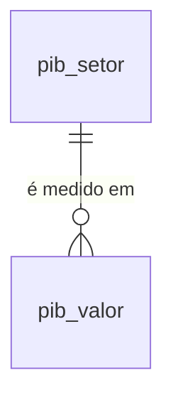

# PIB e Setores (SIDRA 1846) — Dicionário de Dados

## Contexto

Tabelas que recebem as Contas Nacionais Trimestrais do IBGE (agregado 1846, variável 585, classificação `c11255`). Esquema definido em `scripts/setup_duckdb_pib.sql` e aplicado por `scripts/init_db.py`; as linhas vêm de `src/inflatrack/load_pib.py`, a partir do Parquet gerado por `src/inflatrack/ingest_pib.py`.

Esta é a **única fonte do projeto que não vive no PostgreSQL**. Fica no `data/duckdb/inflatrack.duckdb`, o mesmo arquivo das commodities — ver [ADR 0002](../adr/0002-duckdb-unico.md). O critério não foi volume (2.806 linhas), e sim padrão de acesso: a pergunta do InflaTrack cruza fontes, e num arquivo só isso é `JOIN`.

Três decisões moldam o esquema:

- **A dimensão nasce do próprio Parquet.** `nome` e `grupo` vêm dos metadados do SIDRA na ingestão, não de um seed. Se o IBGE renomear um setor, a carga seguinte propaga sozinha (UPSERT em `pib_setor`).
- **`pib_valor` é UPSERT, não insert-only.** Oposto de `observacao` na fonte do [IPCA](sidra.md): lá a revisão do IBGE entra como linha nova para preservar o número com que a plataforma respondeu antes; aqui ela sobrescreve. As Contas Nacionais são revisadas a cada divulgação por construção, e é a série revisada que vale.
- **`grupo` existe porque as categorias não se somam entre si.** São três óticas diferentes da mesma economia. Somar as 23 linhas de um trimestre dá um número sem significado.

!!! info "Sem dado pessoal"
    Agregados macroeconômicos nacionais. Nenhuma pessoa é identificável.

!!! warning "Valores correntes misturam preço e quantidade"
    `valor_milhoes_brl` é a preços **correntes**: a variação entre dois trimestres embute inflação **e** mudança de volume. Para isolar preço seria preciso o deflator implícito, que exige a tabela de índices de volume da mesma pesquisa — ainda não ingerida.

## Modelo Conceitual



Uma dimensão e um fato, sem dimensão de localidade: a tabela 1846 só publica o nível Brasil (N1). Não há recorte por praça, diferente do IPCA.

## Entidades

### pib_setor

Dimensão: as 23 categorias da classificação `c11255`. Populada por UPSERT a partir do Parquet, na carga.

| Campo | Tipo | Descrição |
|---|---|---|
| `codigo` | VARCHAR (PK) | Id interno da categoria no SIDRA — o mesmo devolvido em `D4C` nos valores (ex.: `90707` = PIB a preços de mercado). Não é código natural com hierarquia por prefixo, diferente de `classificacao` no IPCA |
| `nome` | VARCHAR | Nome oficial, direto dos metadados do agregado (ex.: `Transporte, armazenagem e correio`) |
| `grupo` | VARCHAR | `atividade` (14), `demanda` (6) ou `agregado` (3) — ver abaixo |
| `nucleo` | BOOLEAN | `true` para as 12 categorias com efeito mais direto no preço ao consumidor; filtro de `vw_pib_nucleo` |

Os três valores de `grupo`:

| Valor | O que é | Exemplos |
|---|---|---|
| `atividade` | Valor adicionado pela ótica da **produção** | Agropecuária, Comércio, Transporte, Eletricidade e gás |
| `demanda` | Ótica da **despesa** | Consumo das famílias, Exportação, Importação (-) |
| `agregado` | **Totais**, que já somam os anteriores | PIB a preços de mercado, Valor adicionado, Impostos sobre produtos |

Cruzar grupos numa mesma soma duplica ou mistura óticas. O uso correto é somar e comparar **dentro** de um grupo, ou usar `participacao_pib_pct` da view.

### pib_valor

Tabela de fato: o valor a preços correntes de um setor num trimestre. 2.806 linhas, cobrindo 1996T1 – 2026T2.

| Campo | Tipo | Descrição |
|---|---|---|
| `codigo_setor` | VARCHAR (PK, FK `pib_setor`) | Categoria |
| `data_referencia` | DATE (PK) | **Primeiro dia do trimestre**: `1996-07-01` é o 3T/1996. Não é mês — ver a armadilha abaixo |
| `ano` | SMALLINT | Ano, redundante com `data_referencia`, para agrupar sem extrair |
| `trimestre` | TINYINT | 1 a 4, idem |
| `valor_milhoes_brl` | DOUBLE | Valor a preços correntes, em milhões de reais |

Chave primária `(codigo_setor, data_referencia)`. É ela que torna a carga idempotente: recarregar o mesmo trimestre sobrescreve o valor em vez de duplicar.

!!! danger "O período do SIDRA aqui é `AAAATT`, não `AAAAMM`"
    `199603` é o **3º trimestre** de 1996, não março. Reaproveitar `ingest.mes_para_data` daria março silenciosamente, sem erro nenhum. Por isso `pib.trimestre_para_data` rejeita `TT` fora de 1..4.

## Views

### vw_pib_setor_trimestral

Série longa com o join da dimensão e as duas leituras derivadas. Uma linha por `(setor, trimestre)`.

| Campo | Tipo | Descrição |
|---|---|---|
| `data_referencia`, `ano`, `trimestre` | DATE, SMALLINT, TINYINT | Como em `pib_valor` |
| `codigo_setor`, `setor`, `grupo`, `nucleo` | VARCHAR, VARCHAR, VARCHAR, BOOLEAN | Como em `pib_setor` |
| `valor_milhoes_brl` | DOUBLE | Como em `pib_valor` |
| `var_anual_pct` | DOUBLE | Variação % contra o **mesmo trimestre do ano anterior** (`lag 4`). Nulo nos 4 primeiros trimestres da série de cada setor |
| `participacao_pib_pct` | DOUBLE | % que o setor representa do PIB (`codigo_setor = '90707'`) naquele trimestre |

A comparação é contra o mesmo trimestre do ano anterior, e não contra o trimestre imediatamente anterior, porque tira a sazonalidade sem exigir série dessazonalizada — que a tabela 1846 não oferece.

### vw_pib_nucleo

`vw_pib_setor_trimestral` filtrada por `nucleo = true`. As 12 categorias:

| Código | Categoria | Grupo | Por que está no núcleo |
|---|---|---|---|
| `90687` | Agropecuária — total | atividade | Custo do alimento na origem |
| `90695` | Eletricidade e gás, água, esgoto, resíduos | atividade | Energia embutida em todo produto |
| `90696` | Serviços — total | atividade | Maior peso no IPCA de serviços |
| `90697` | Comércio | atividade | A margem do próprio lojista |
| `90698` | Transporte, armazenagem e correio | atividade | Frete até a prateleira |
| `90700` | Atividades financeiras e de seguros | atividade | Custo do capital de giro |
| `90706` | Impostos líquidos sobre produtos | agregado | Carga tributária sobre o preço final |
| `90707` | PIB a preços de mercado | agregado | Denominador de tudo |
| `93404` | Despesa de consumo das famílias | demanda | A demanda que puxa o preço |
| `93405` | Despesa de consumo da administração pública | demanda | Demanda autônoma |
| `93407` | Exportação de bens e serviços | demanda | Concorre com o abastecimento interno |
| `93408` | Importação de bens e serviços (-) | demanda | Repasse do câmbio |

As outras 11 continuam em `pib_valor` — mudar o recorte é editar `pib.NUCLEO` e recarregar, sem baixar nada de novo.

### vw_features_pib_trimestral

Formato largo, **uma linha por trimestre**, uma coluna DOUBLE por categoria do núcleo. Espelha `vw_features_daily` e `vw_features_monthly` das commodities, para alimentar o mesmo tipo de modelo.

| Campo | Origem |
|---|---|
| `data_referencia`, `ano`, `trimestre` | Chave da linha |
| `pib` | `90707` |
| `agropecuaria` | `90687` |
| `eletricidade_gas` | `90695` |
| `servicos` | `90696` |
| `comercio` | `90697` |
| `transporte` | `90698` |
| `atividades_financeiras` | `90700` |
| `impostos_sobre_produtos` | `90706` |
| `consumo_familias` | `93404` |
| `consumo_administracao_publica` | `93405` |
| `exportacao` | `93407` |
| `importacao` | `93408` |

## Camadas anteriores

O DuckDB é a camada servida. Antes dele:

| Camada | Caminho | Formato |
|---|---|---|
| Bruta | `data/raw/pib_raw/1846-AAAA.json.gz` | Resposta compacta da API (`/f/c/h/n`), um arquivo por ano |
| Transformada | `data/parquet/pib/1846-AAAA.parquet` | Parquet, um por ano |

Campos do JSON bruto, no formato compacto do SIDRA (só códigos, sem cabeçalho):

| Campo | Descrição |
|---|---|
| `V` | Valor. `...`, `..`, `-` e `X` são marcadores de **ausência** — mas `-0.67` é valor negativo de verdade |
| `D1C` | Código da localidade (sempre `1`, Brasil) |
| `D2C` | Código da variável (sempre `585`) |
| `D3C` | Período `AAAATT` |
| `D4C` | Categoria — vira `pib_setor.codigo` |
| `NC`, `MC` | Nível territorial e unidade de medida |

O Parquet já é o esquema de `pib_valor` acrescido de `setor`, `grupo` e `nucleo` desnormalizados — é dele que a dimensão é reconstruída na carga.

!!! note "Por que o Parquet fica em subpasta"
    `inflatrack.load_commodities` lê `data/parquet/*.parquet` com glob raso e pressupõe o esquema `(symbol, data_referencia, preco)`. Um arquivo de PIB solto ali quebraria a carga das commodities.

## Exemplos de Uso

```sql
-- Quais setores do núcleo mais aceleraram no último trimestre publicado.
select setor, valor_milhoes_brl, var_anual_pct, participacao_pib_pct
from vw_pib_nucleo
where data_referencia = (select max(data_referencia) from pib_valor)
order by var_anual_pct desc;

-- Custo de frete x margem do comércio: as duas séries lado a lado, em % ao ano.
select data_referencia,
       max(var_anual_pct) filter (codigo_setor = '90698') as transporte_pct,
       max(var_anual_pct) filter (codigo_setor = '90697') as comercio_pct
from vw_pib_setor_trimestral
where data_referencia >= date '2020-01-01'
group by data_referencia
order by data_referencia;

-- Composição da demanda num trimestre. O filtro por grupo não é cosmético:
-- sem ele a soma misturaria óticas e o total não faria sentido.
select setor, round(100.0 * valor_milhoes_brl / sum(valor_milhoes_brl) over (), 1) as pct
from vw_pib_setor_trimestral
where grupo = 'demanda' and data_referencia = date '2026-04-01'
order by pct desc;

-- Cruzamento entre fontes — o motivo do DuckDB único (ADR 0002).
-- Petróleo Brent no trimestre x valor adicionado do transporte.
select p.data_referencia, p.var_anual_pct as transporte_pct, avg(c.preco) as brent_medio
from vw_pib_setor_trimestral p
join commodity_cotacao c
  on c.symbol = 'BRENT'
 and c.data_referencia >= p.data_referencia
 and c.data_referencia < p.data_referencia + interval 3 month
where p.codigo_setor = '90698'
group by p.data_referencia, p.var_anual_pct
order by p.data_referencia desc
limit 8;
```

## Referências

- [Tabela 1846 no SIDRA](https://sidra.ibge.gov.br/tabela/1846)
- [Contas Nacionais Trimestrais — IBGE](https://www.ibge.gov.br/estatisticas/economicas/contas-nacionais/9300-contas-nacionais-trimestrais.html)
- Caracterização da origem: [PIB e Setores (SIDRA 1846)](../fontes/pib.md)
- Decisão do banco: [ADR 0002 — DuckDB único](../adr/0002-duckdb-unico.md)
