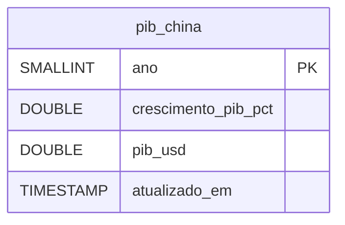

# PIB da China (World Bank) — Dicionário de Dados

## Contexto

Tabela que recebe os dois indicadores anuais do PIB chinês publicados pelo Banco Mundial (`NY.GDP.MKTP.KD.ZG` e `NY.GDP.MKTP.CD`, país `CHN`). Esquema definido em `scripts/setup_duckdb_pib_china.sql` e aplicado pela própria carga; as linhas vêm de `src/inflatrack/load_pib_china.py`, a partir do Parquet gerado por `src/inflatrack/ingest_pib_china.py`.

Fica no `data/duckdb/inflatrack.duckdb`, o mesmo arquivo das commodities, do PIB brasileiro e das séries do Banco Central — ver [ADR 0002](../adr/0002-duckdb-unico.md). O motivo é o de sempre neste projeto: a pergunta é de cruzamento, e num arquivo só isso é `JOIN`.

Três decisões moldam o esquema:

- **Uma tabela larga, sem dimensão.** Os dois indicadores viram duas colunas da mesma linha, não duas linhas de um fato com dimensão de indicador. São exatamente dois, do mesmo país, na mesma frequência: uma dimensão de duas linhas fixas só acrescentaria um `join`.
- **`ano` é a chave, não uma data.** A série é anual e o Banco Mundial a publica como ano civil (`date: "2024"`). Materializar isso como `DATE` obrigaria a escolher um dia arbitrário e abriria espaço para comparar com mês.
- **UPSERT por ano, com marca de carga.** O Banco Mundial revisa anos anteriores a cada divulgação, e é a série revisada que vale. `atualizado_em` registra quando a linha foi gravada pela última vez — é o único rastro de que um ano antigo mudou de valor.

!!! info "Sem dado pessoal"
    Agregado macroeconômico de um país, publicado por organismo multilateral. Nenhuma pessoa é identificável.

!!! warning "As duas colunas não são comparáveis entre si"
    `crescimento_pib_pct` é real (volume, descontada a inflação) e `pib_usd` é nominal em dólar corrente. A variação de `pib_usd` entre dois anos **não** reproduz `crescimento_pib_pct`: ela embute inflação chinesa e variação do câmbio yuan/dólar. Para taxa de crescimento, use a coluna de crescimento; nunca a derive do nível.

## Modelo Conceitual



Tabela única. Sem dimensão de localidade (só a China), sem dimensão de indicador (só dois, virados em coluna) e sem dimensão de tempo (o ano é a própria chave).

## Entidades

### pib_china

Uma linha por ano civil. O histórico completo do Banco Mundial começa em 1960 e tem cerca de 60 a 65 pontos por série.

| Campo | Tipo | Descrição |
|---|---|---|
| `ano` | SMALLINT (PK) | Ano civil de referência, do campo `date` da API |
| `crescimento_pib_pct` | DOUBLE | Crescimento **real** do PIB no ano, em % (indicador `NY.GDP.MKTP.KD.ZG`). Nulo quando a API devolve `value: null` |
| `pib_usd` | DOUBLE | PIB **nominal** em dólares correntes (indicador `NY.GDP.MKTP.CD`). Valor absoluto, não em milhões nem em bilhões — a ordem de grandeza é 10¹³. Nulo quando a API devolve `value: null` |
| `atualizado_em` | TIMESTAMP | Quando a linha foi gravada ou atualizada pela última vez. `DEFAULT current_timestamp` na inserção, `now()` no UPSERT |

Chave primária `ano`. É ela que torna a carga idempotente: reexecutar sobrescreve os valores do ano e avança `atualizado_em`, em vez de duplicar.

!!! danger "`NULL` aqui é ausência de verdade, e as duas colunas são anuláveis"
    O ano mais recente costuma aparecer na resposta com `value: null` — a linha existe, o valor não. `transformar` preserva esse nulo em vez de descartar a linha, e as colunas são as únicas anuláveis entre as fontes analíticas do projeto. Um `avg(crescimento_pib_pct)` ignora esses anos silenciosamente; um `join` por `ano` os encontra e devolve `NULL`. Filtre com `is not null` quando o indicador for obrigatório para a conta.

    Os anos das duas colunas também não coincidem necessariamente: cada indicador é lido de uma resposta separada e a união é feita por `ano`, então um ano pode ter crescimento sem nível, ou o contrário.

## Views

Nenhuma. Diferente das commodities e do PIB brasileiro, esta fonte não tem view de *feature*: são duas colunas já em formato largo, uma linha por ano, e não há o que pivotar nem derivada a calcular na camada servida. O cruzamento com as demais séries é feito na própria consulta, por `year(data_referencia) = ano`.

## Camadas anteriores

O DuckDB é a camada servida. Antes dele:

| Camada | Caminho | Formato |
|---|---|---|
| Bruta | `data/raw/pib_china/NY.GDP.MKTP.KD.ZG.json.gz` e `.../NY.GDP.MKTP.CD.json.gz` | Resposta completa da API em gzip, um arquivo por indicador |
| Transformada | `data/parquet/pib_china/pib_china.parquet` | Parquet único, já no esquema da tabela |

A camada bruta guarda a resposta inteira, incluindo o elemento de metadados (`page`, `pages`, `total`) que a transformação descarta. Diferente das commodities, o nome do arquivo bruto não tem data nem modo: cada rodada sobrescreve o anterior, porque a resposta é sempre a série completa.

Campos do JSON bruto do Banco Mundial (a resposta é uma lista de dois elementos: metadados e observações):

| Campo | Descrição |
|---|---|
| `[0]` | Metadados de paginação (`page`, `pages`, `per_page`, `total`). A ingestão pede `per_page: 1000` para não paginar |
| `[1][].date` | Ano como **string** (ex.: `"2024"`); validado com `isdigit()` antes de virar `int` |
| `[1][].value` | Valor do indicador, ou `null`. Vira a coluna correspondente |
| `[1][].indicator`, `[1][].country` | Código e nome do indicador e do país. Não são carregados — o indicador está implícito na coluna, e o país na própria tabela |
| `[1][].unit`, `[1][].obs_status`, `[1][].decimal` | Vêm vazios ou constantes para estes indicadores; descartados |

O Parquet tem exatamente as três colunas de dado da tabela (`ano`, `crescimento_pib_pct`, `pib_usd`), ordenadas por ano. `atualizado_em` não trafega por ele: é gerado no momento da carga.

!!! note "Por que o Parquet fica em subpasta"
    `inflatrack.load_commodities` lê `data/parquet/*.parquet` com glob raso e pressupõe o esquema `(symbol, data_referencia, preco)`. Um arquivo de PIB da China solto ali quebraria a carga das commodities — a mesma razão da subpasta do [PIB brasileiro](pib.md).

## Exemplos de Uso

```sql
-- Últimos anos com crescimento publicado. O filtro exclui o ano ainda sem valor.
select ano, crescimento_pib_pct, pib_usd / 1e12 as pib_trilhoes_usd
from pib_china
where crescimento_pib_pct is not null
order by ano desc
limit 10;

-- A pergunta que motiva a fonte: crescimento chinês x preço médio anual do petróleo
-- e do índice global de commodities. O JOIN é por ano civil.
select p.ano,
       p.crescimento_pib_pct,
       avg(c.preco) filter (c.symbol = 'BRENT')           as brent_medio_usd,
       avg(c.preco) filter (c.symbol = 'ALL_COMMODITIES') as indice_global_medio
from pib_china p
join commodity_cotacao c on year(c.data_referencia) = p.ano
where p.ano >= 2000
group by p.ano, p.crescimento_pib_pct
order by p.ano desc;

-- Defasagem: o crescimento de um ano contra o preço do ano seguinte.
-- A China é indicador antecedente da demanda, então o lag é a leitura útil.
select p.ano,
       p.crescimento_pib_pct,
       (select avg(preco) from commodity_cotacao
        where symbol = 'ALL_COMMODITIES' and year(data_referencia) = p.ano + 1) as indice_ano_seguinte
from pib_china p
where p.crescimento_pib_pct is not null and p.ano >= 2000
order by p.ano desc;

-- Quais anos foram revisados na última carga: atualizado_em é o único rastro.
select ano, crescimento_pib_pct, atualizado_em
from pib_china
order by atualizado_em desc, ano desc
limit 10;
```

## Referências

- [API de indicadores do Banco Mundial](https://datahelpdesk.worldbank.org/knowledgebase/articles/889392-about-the-indicators-api-documentation)
- [Crescimento do PIB (NY.GDP.MKTP.KD.ZG) — China](https://data.worldbank.org/indicator/NY.GDP.MKTP.KD.ZG?locations=CN)
- [PIB nominal em USD (NY.GDP.MKTP.CD) — China](https://data.worldbank.org/indicator/NY.GDP.MKTP.CD?locations=CN)
- Esquema: `scripts/setup_duckdb_pib_china.sql`
- Caracterização da origem: [PIB da China (World Bank)](../fontes/pib_china.md)
- Decisão do banco: [ADR 0002 — DuckDB único](../adr/0002-duckdb-unico.md)
