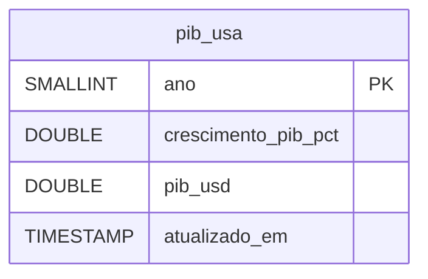

# PIB dos Estados Unidos (World Bank) — Dicionário de Dados

## Contexto

Tabela que recebe os dois indicadores anuais do PIB norte-americano publicados pelo Banco Mundial (`NY.GDP.MKTP.KD.ZG` e `NY.GDP.MKTP.CD`, país `USA`). Fica localizada em `data/duckdb/inflatrack.duckdb`, o mesmo banco analítico único das commodities, séries do Banco Central e do PIB da China — ver [ADR 0002](../adr/0002-duckdb-unico.md).

Três decisões moldam o esquema:

- **Uma tabela larga, sem dimensão.** Os dois indicadores viram duas colunas da mesma linha, sem necessidade de dimensão de indicador.
- **`ano` é a chave, não uma data.** A série é anual e o Banco Mundial a publica como ano civil (`date: "2024"`).
- **UPSERT por ano, com marca de carga.** `atualizado_em` registra quando a linha foi gravada pela última vez para registrar revisões do Banco Mundial.

!!! info "Sem dado pessoal"
    Agregado macroeconômico global, publicado por organismo multilateral. Nenhuma pessoa é identificável.

!!! warning "As duas colunas não são comparáveis entre si"
    `crescimento_pib_pct` é real (volume, descontada a inflação) e `pib_usd` é nominal em dólar corrente. Para taxa de crescimento, use a coluna de crescimento; nunca a derive do nível.

## Modelo Conceitual



Tabela única. Sem dimensão de localidade (só os EUA) e sem dimensão de tempo (o ano é a própria chave).

## Entidades

### pib_usa

Uma linha por ano civil. O histórico do Banco Mundial para os EUA começa em 1960.

| Campo | Tipo | Descrição |
|---|---|---|
| `ano` | SMALLINT (PK) | Ano civil de referência, do campo `date` da API |
| `crescimento_pib_pct` | DOUBLE | Crescimento **real** do PIB no ano, em % (indicador `NY.GDP.MKTP.KD.ZG`). Nulo quando a API devolve `value: null` |
| `pib_usd` | DOUBLE | PIB **nominal** em dólares correntes (indicador `NY.GDP.MKTP.CD`). Valor absoluto (ordem de grandeza de 10¹³ USD). Nulo quando a API devolve `value: null` |
| `atualizado_em` | TIMESTAMP | Quando a linha foi gravada ou atualizada pela última vez (`DEFAULT current_timestamp`) |

Chave primária `ano`.

!!! danger "`NULL` indica ausência de dado publicado"
    O ano mais recente pode retornar `value: null` na API. Preserva-se o nulo no banco e recomenda-se o uso de `WHERE crescimento_pib_pct IS NOT NULL` em cálculos agregados.

## Views

Nenhuma. O cruzamento com as demais séries é feito na própria consulta por `year(data_referencia) = ano`.

## Camadas anteriores

| Camada | Caminho | Formato |
|---|---|---|
| Bruta | `data/raw/pib_usa/NY.GDP.MKTP.KD.ZG.json.gz` e `.../NY.GDP.MKTP.CD.json.gz` | Resposta da API em gzip |
| Transformada | `data/parquet/pib_usa/pib_usa.parquet` | Parquet único |

## Exemplos de Uso

```sql
-- Histórico recente do PIB norte-americano em trilhões de USD
select ano, crescimento_pib_pct, pib_usd / 1e12 as pib_trilhoes_usd
from pib_usa
where crescimento_pib_pct is not null
order by ano desc
limit 10;

-- Cruzamento PIB dos EUA x Cotação Média Anual do Dólar Comercial
select u.ano,
       u.crescimento_pib_pct,
       avg(d.cotacao_venda) as cotacao_dolar_media
from pib_usa u
join dolar_cotacao d on year(d.data_referencia) = u.ano
where u.ano >= 2000
group by u.ano, u.crescimento_pib_pct
order by u.ano desc;
```

## Referências

- [Crescimento do PIB (NY.GDP.MKTP.KD.ZG) — EUA](https://data.worldbank.org/indicator/NY.GDP.MKTP.KD.ZG?locations=US)
- [PIB nominal em USD (NY.GDP.MKTP.CD) — EUA](https://data.worldbank.org/indicator/NY.GDP.MKTP.CD?locations=US)
- Caracterização da origem: [PIB dos EUA (World Bank)](../fontes/pib_usa.md)
- Decisão do banco: [ADR 0002 — DuckDB único](../adr/0002-duckdb-unico.md)
