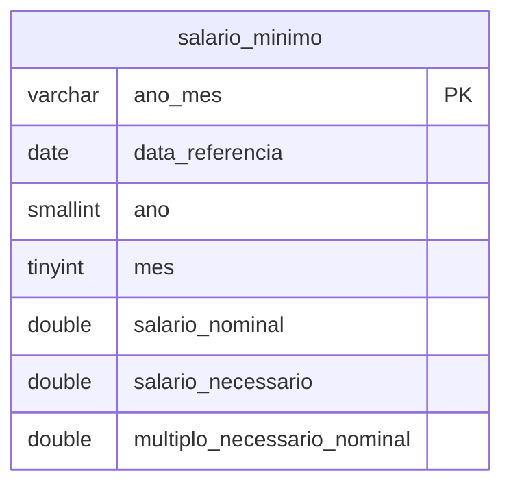

# Salário Mínimo e Cesta Básica (DIEESE) — Dicionário de Dados

## Contexto

Esta seção detalha o schema físico da fonte de dados da Pesquisa Nacional da Cesta Básica de Alimentos (DIEESE), armazenado na tabela `salario_minimo` dentro do banco analítico compartilhado (**DuckDB** em `data/duckdb/inflatrack.duckdb`), conforme estabelecido pelo [ADR 0002](../adr/0002-duckdb-unico.md).

A fonte fornece a série histórica mensal do salário mínimo oficial federal (nominal) e do salário mínimo necessário calculado com base no preceito constitucional (CF/88, art. 7º, IV) e no custo de vida apurado nas capitais.

---

## Modelo Conceitual

A tabela `salario_minimo` atua como dimensão temporal de poder de compra e renda familiar, vinculando-se temporalmente por `ano_mes` às observações de preços de produtos e índices inflacionários:



---

## Entidades

### Tabela: `salario_minimo`

Armazena os valores mensais de salário mínimo desde o início do Plano Real (julho de 1994).

| Coluna | Tipo (DuckDB) | Chave | Descrição |
|---|---|---|---|
| `ano_mes` | `VARCHAR(7)` | PK | Ano e mês de apuração no formato `YYYY-MM` (ex.: `2026-08`). |
| `data_referencia` | `DATE` | | Data canônica referente ao primeiro dia do mês (`YYYY-MM-01`). Facilita junções com séries temporais contínuas. |
| `ano` | `SMALLINT` | | Ano civil da observação (ex.: `2026`), útil para agregações anuais sem custo de parsing. |
| `mes` | `TINYINT` | | Mês civil da observação (1 a 12). |
| `salario_nominal` | `DOUBLE` | | Salário mínimo oficial federal vigente fixado por lei no mês de referência (em R$). |
| `salario_necessario` | `DOUBLE` | | Salário mínimo calculado pelo DIEESE necessário para suprir as despesas básicas de uma família de quatro pessoas (em R$). |
| `multiplo_necessario_nominal` | `DOUBLE` | | Múltiplo derivado pela razão entre o salário necessário e o nominal (`salario_necessario / salario_nominal`). |

---

## Consultas de Exemplo

### 1. Série Recente do Poder de Compra

```sql
SELECT 
    ano_mes,
    salario_nominal,
    salario_necessario,
    round(multiplo_necessario_nominal, 2) AS vezes_nominal
FROM salario_minimo
WHERE ano >= 2024
ORDER BY data_referencia DESC;
```

### 2. Variação Interanual do Salário Nominal vs. Inflação

Permite avaliar se o piso salarial acompanhou o ritmo inflacionário no período de 12 meses:

```sql
SELECT 
    ano_mes,
    salario_nominal,
    round((salario_nominal / lag(salario_nominal, 12) OVER (ORDER BY data_referencia) - 1) * 100, 2) AS reajuste_anual_salario_pct
FROM salario_minimo
ORDER BY data_referencia DESC;
```
