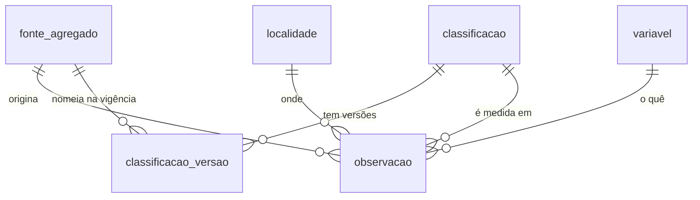

# SIDRA/IBGE — Dicionário de Dados

## Contexto

Tabelas que recebem o IPCA e o INPC publicados pelo IBGE via API do SIDRA (agregados 2938, 1419, 7060, 7063 e 1737). Esquema definido em `migrations/0001_referencia_ipca.sql`; as tabelas pequenas são semeadas em `migrations/0003_seed_referencia.sql`, e a cesta (`classificacao`, `classificacao_versao`) vem da ingestão, a partir dos metadados de cada agregado.

Duas decisões moldam o esquema (ver [ADR 0001](../arquitetura.md)):

- **`observacao` é insert-only.** O IBGE revisa valor já publicado; a revisão entra como linha nova para preservar o número com que a plataforma respondeu antes.
- **O nome da categoria tem vigência.** Entre 2006 e 2026, 43 subitens mudaram de nome mantendo o código; por isso o nome fica em `classificacao_versao`, não em `classificacao`.

!!! info "Sem dado pessoal"
    Todas as tabelas desta fonte são índices agregados por categoria e localidade. Nenhuma pessoa é identificável.

## Modelo Conceitual



## Entidades

### fonte_agregado

Cada agregado do SIDRA que alimenta a plataforma, com o que ele cobre. 5 linhas.

| Campo | Tipo | Descrição |
|---|---|---|
| `id` | smallint (PK) | Id do agregado no SIDRA (2938, 1419, 7060, 7063, 1737) |
| `indice` | text | `IPCA` ou `INPC` |
| `nome` | text | Descrição do agregado |
| `periodo_inicio` | date | Primeiro mês publicado |
| `periodo_fim` | date | Último mês publicado; nulo = série viva |
| `tem_acum_12m` | boolean | `false` só no 2938: a acumulada em 12 meses precisa ser derivada da variação mensal |

### variavel

Métricas publicadas pelo IBGE. 11 linhas.

| Campo | Tipo | Descrição |
|---|---|---|
| `codigo` | smallint (PK) | Código da variável no SIDRA (ex.: 63 = variação mensal, 2265 = acumulada em 12 meses, 2266 = número-índice) |
| `nome` | text | Nome oficial |
| `unidade` | text | `%` ou `Número-índice` |

### localidade

Onde o índice é coletado. 17 linhas (o 2938 cobre só 12 delas).

| Campo | Tipo | Descrição |
|---|---|---|
| `codigo_ibge` | integer (PK) | Código IBGE (1 = Brasil, 5300108 = Brasília) |
| `nome` | text | Nome da localidade |
| `tipo` | text | `pais`, `regiao_metropolitana` ou `municipio` |
| `uf` | char(2) | UF; nulo para Brasil |

### classificacao

Chave natural estável de um nível da cesta. O código do pai é prefixo do filho: grupo `1` → subgrupo `11` → item `1101` → subitem `1101002`.

| Campo | Tipo | Descrição |
|---|---|---|
| `codigo` | text (PK) | Código natural; `7169` é o índice geral |
| `nivel` | text | `geral`, `grupo`, `subgrupo`, `item` ou `subitem` |

### classificacao_versao

Dimensão de variação lenta (tipo 2): o nome e a posição que um código teve em cada fonte.

| Campo | Tipo | Descrição |
|---|---|---|
| `id` | bigint (PK) | Chave substituta |
| `codigo` | text (FK `classificacao`) | Código da categoria |
| `id_fonte` | smallint (FK `fonte_agregado`) | Agregado em que esse nome vigorou |
| `nome` | text | Nome na vigência (ex.: `1111004` "Leite pasteurizado" até 2011, "Leite longa vida" depois) |
| `codigo_pai` | text (FK `classificacao`) | Pai na árvore naquela fonte |
| `vigencia_inicio` / `vigencia_fim` | date | Janela de validade; `vigencia_fim` nulo = vigente |

Único por `(codigo, id_fonte)`.

### observacao

Tabela de fato: o valor de uma variável, para uma categoria, numa localidade, num mês. Concentra todo o volume (~4,7 mi linhas de IPCA, ~6,4 mi com INPC).

| Campo | Tipo | Descrição |
|---|---|---|
| `id` | bigint (PK) | Chave substituta |
| `id_fonte` | smallint (FK `fonte_agregado`) | Agregado de origem |
| `codigo_classificacao` | text (FK `classificacao`) | Categoria da cesta |
| `codigo_localidade` | integer (FK `localidade`) | Localidade |
| `codigo_variavel` | smallint (FK `variavel`) | Variável medida |
| `mes_referencia` | date | Mês de referência, sempre no dia 1 |
| `valor` | numeric(16,7) | Valor publicado; negativo é deflação |
| `ingerido_em` | timestamptz | Quando a linha foi carregada; desempata revisões do IBGE |

Índices:

- `observacao_versao_uk` (único): fonte, categoria, localidade, variável, mês **e valor**. Recarregar o mesmo dado não insere nada; valor revisado entra como linha nova.
- `observacao_consulta_idx`: (categoria, localidade, variável, mês desc), usado pelas perguntas 1, 4 e 5.

## Exemplos de Uso

```sql
-- Pergunta 1: acumulado em 12 meses do arroz em Brasília, com o nome vigente.
-- ingerido_em desc pega a revisão mais recente, se o IBGE tiver republicado o mês.
select o.mes_referencia, cv.nome, o.valor
from observacao o
join classificacao_versao cv
  on cv.codigo = o.codigo_classificacao and cv.id_fonte = o.id_fonte
where o.codigo_classificacao = '1101002'
  and o.codigo_localidade = 5300108
  and o.codigo_variavel = 2265
order by o.mes_referencia desc, o.ingerido_em desc
limit 1;

-- Pergunta 3 (caminho exato): inflação acumulada jul/2006 -> jul/2026 pelo número-índice.
select fim.valor / ini.valor - 1 as inflacao_acumulada
from observacao ini
join observacao fim
  on fim.id_fonte = ini.id_fonte and fim.codigo_variavel = ini.codigo_variavel
where ini.id_fonte = 1737
  and ini.codigo_variavel = 2266
  and ini.mes_referencia = date '2006-07-01'
  and fim.mes_referencia = date '2026-07-01';
```

## Referências

- [API do SIDRA — ajuda](https://apisidra.ibge.gov.br/home/ajuda)
- [Metadados de agregados do IBGE](https://servicodados.ibge.gov.br/api/docs/agregados?versao=3)
- Caracterização da origem: [SIDRA/IBGE](../fontes/sidra.md)
