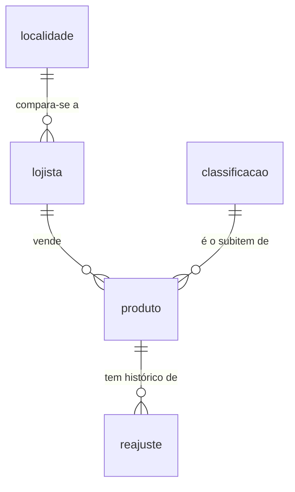

# Transacional (Lojista) — Dicionário de Dados

## Contexto

Tabelas do lado próprio do InflaTrack: o lojista, o que ele vende e os reajustes que aplica. Diferente da referência do IBGE, esse lado tem escrita de verdade — aplicar um reajuste é a única operação do sistema que exige transação com A, C e I garantidas. Esquema definido em `migrations/0002_lojista.sql`.

A ponte entre este lado e a referência pública é a FK `produto.codigo_subitem_ipca`, que aponta para `classificacao` (ver [dicionário do SIDRA](sidra.md)).

!!! warning "Dado pessoal (LGPD)"
    `lojista.cnpj` é tratado como dado pessoal: CNPJ de MEI se confunde com a pessoa física. Não é exposto em nenhum recorte analítico.

## Modelo Conceitual



## Entidades

### lojista

O comerciante que consulta e aplica reajuste.

| Campo | Tipo | Descrição |
|---|---|---|
| `id` | bigint (PK) | Chave substituta |
| `nome_fantasia` | text | Nome do estabelecimento; não pode ser vazio |
| `cnpj` | char(14) | Chave natural única; dado pessoal (LGPD) |
| `codigo_localidade` | integer (FK `localidade`) | A praça a que o lojista se compara — só uma das 17 localidades medidas pelo IPCA |
| `codigo_grupo_ipca` | text (FK `classificacao`) | Setor principal do lojista |
| `criado_em` | timestamptz | Data de cadastro |

### produto

Um item que o lojista comercializa, ligado ao subitem do IPCA que melhor o representa.

| Campo | Tipo | Descrição |
|---|---|---|
| `id` | bigint (PK) | Chave substituta |
| `id_lojista` | bigint (FK `lojista`) | Dono do produto |
| `nome` | text | Nome do produto; único por lojista |
| `preco_inicial_centavos` | integer | Preço no cadastro, em centavos (`> 0`) |
| `custo_inicial_centavos` | integer | Custo no cadastro, em centavos (`>= 0`) |
| `codigo_subitem_ipca` | text (FK `classificacao`) | O de-para para o subitem do IPCA — é essa FK que responde as perguntas de reajuste |
| `criado_em` | timestamptz | Data de cadastro |

Único por `(id_lojista, nome)`. Índice em `codigo_subitem_ipca` (`produto_subitem_idx`).

### reajuste

Um evento de mudança de preço, com o IPCA que o justificou. Insert-only: o preço corrente nunca é sobrescrito, é sempre derivado do último reajuste.

| Campo | Tipo | Descrição |
|---|---|---|
| `id` | bigint (PK) | Chave substituta |
| `id_produto` | bigint (FK `produto`) | Produto reajustado |
| `preco_anterior_centavos` | integer | Preço antes do reajuste (`> 0`) |
| `preco_novo_centavos` | integer | Preço depois do reajuste (`> 0`, diferente do anterior) |
| `ipca_acumulado_ref` | numeric(8,4) | IPCA acumulado que justificou o reajuste |
| `mes_referencia_ipca` | date | Mês do IPCA usado como referência |
| `motivo` | text | Justificativa do reajuste |
| `aplicado_em` | timestamptz | Quando o reajuste foi aplicado |

Índice em `(id_produto, aplicado_em desc)` (`reajuste_produto_idx`).

### produto_preco_atual (view)

Resolve o preço vigente de um produto sem duplicar dado: pega o último reajuste, ou o preço de cadastro se ainda não houve nenhum.

```sql
select p.id           as id_produto,
       p.id_lojista,
       p.nome,
       p.codigo_subitem_ipca,
       coalesce(r.preco_novo_centavos, p.preco_inicial_centavos) as preco_centavos,
       coalesce(r.aplicado_em, p.criado_em)                      as vigente_desde
from produto p
left join lateral (
    select preco_novo_centavos, aplicado_em
    from reajuste
    where id_produto = p.id
    order by aplicado_em desc
    limit 1
) r on true;
```

## Exemplos de Uso

```sql
-- Pergunta 5: reajuste mínimo para não perder margem em relação ao IPCA do último ano.
-- Junta o produto do lojista com a observação do IPCA pelo subitem.
select pr.nome, pr.preco_centavos, o.valor as ipca_acumulado_12m
from produto_preco_atual pr
join produto p on p.id = pr.id_produto
join observacao o
  on o.codigo_classificacao = p.codigo_subitem_ipca
 and o.codigo_localidade = (select codigo_localidade from lojista where id = p.id_lojista)
 and o.codigo_variavel = 2265
where pr.id_lojista = 1
order by o.mes_referencia desc
limit 1;

-- Aplicar um reajuste (dentro de uma transação: INSERT + leitura consistente do preço).
begin;
insert into reajuste (id_produto, preco_anterior_centavos, preco_novo_centavos,
                       ipca_acumulado_ref, mes_referencia_ipca, motivo)
values (1, 1000, 1080, 8.00, date '2026-07-01', 'reajuste anual pelo IPCA acumulado');
commit;
```

## Referências

- Esquema: `migrations/0002_lojista.sql`
- Fonte de referência: [SIDRA/IBGE — Dicionário de Dados](sidra.md)
