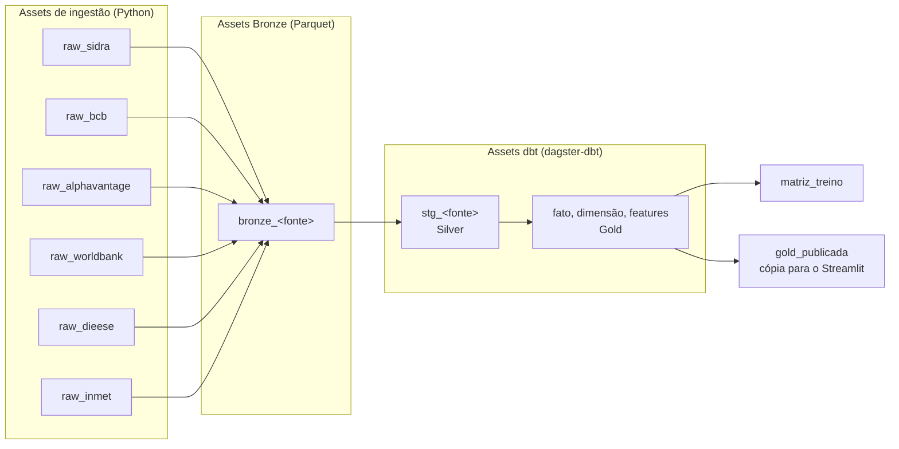

# Orquestração (Dagster)

O **Dagster** é o orquestrador do InflaTrack: é ele que decide *quando* cada pedaço do dado é produzido, *em que ordem* e *o que refazer* quando algo falha. Hoje cada etapa roda à mão, por uma receita do `justfile`; o Dagster substitui esse disparo manual sem mudar o código de ingestão.

!!! info "Status: planejado"
    Nenhum código Dagster está no repositório ainda. Esta página é o contrato do que será implementado — a divisão de responsabilidades já está decidida e sustenta o [ADR 0002](../adr/0002-duckdb-unico.md) e os [Componentes](../arquitetura/componentes.md#dagster).

## Por que Dagster e não Airflow

| Critério | Airflow | Dagster | Escolha |
|---|---|---|---|
| Unidade de orquestração | Tarefa (o que executar) | **Ativo de dado** (o que deve existir) | Dagster — nosso pipeline é definido pelas tabelas que precisam estar atualizadas |
| Integração com dbt | Via Cosmos, camada extra | `dagster-dbt` nativo: cada model vira um asset | Dagster |
| Backfill histórico | DAG run por data | Partição por asset, com estado por partição | Dagster — o IPCA é mensal e tem 20 anos de histórico |
| Frescor do dado | Fora do núcleo | *Freshness* é conceito de primeira classe | Dagster |
| Tarefas operacionais (e-mail, rotina em servidor) | Forte | Possível, não é o foco | Airflow venceria — não é o nosso caso |

O Airflow é excelente para **tarefas**; o InflaTrack orquestra **dados**. Nenhuma etapa nossa é "mandar um e-mail" ou "rodar um script no servidor": toda etapa produz uma tabela ou um arquivo que alguém consulta depois.

## O que o Dagster faz aqui

* **Executa o grafo inteiro** — ingestores Python e `dbt build` no mesmo grafo de dependência, sem um `just` manual por fonte.
* **Repete só o que falhou** — retry por asset; se o INMET cair, o IPCA não é reprocessado.
* **Roda backfill por partição** — recarregar jan/2020 a dez/2021 do IPCA é selecionar um intervalo de partições, não editar um comando.
* **Serializa o escritor do DuckDB** — um limite de concorrência global garante o escritor único que o arquivo exige.
* **Expõe o estado do dado** — a interface mostra, por ativo, quando foi materializado pela última vez e se está fora do prazo de frescor.

## O grafo de ativos



Cada caixa é um **ativo**: uma coisa que precisa existir e estar atualizada. O Dagster não pergunta "essa tarefa rodou?", e sim "esse dado está lá e está fresco?".

## Organização prevista do código

```
orchestration/
├── definitions.py          # Definitions: assets, schedules, sensors, resources
├── assets/
│   ├── ingestao.py         # um asset por fonte, chamando src/inflatrack/ingest_*.py
│   ├── dbt.py              # @dbt_assets — carrega o manifest do projeto dbt
│   └── publicacao.py       # cópia da Gold lida pelo Streamlit
├── partitions.py           # mensal (IPCA), diária (macro/clima), trimestral (PIB), anual (China)
├── schedules.py            # agendamentos por grupo de partição
└── resources.py            # conexões DuckDB e Postgres, caminhos de data/
```

A lógica de negócio **não muda de lugar**: os assets chamam os módulos de `src/inflatrack/` que já existem. O Dagster fica com a orquestração, e nada mais — o mesmo princípio que mantém o cliente de origem ignorante sobre disco e banco.

## Partições e agendamento

| Grupo de ativos | Partição | Agendamento previsto | Origem da cadência |
|---|---|---|---|
| IPCA/INPC (SIDRA) | Mensal | Dias 9 a 13, 1×/dia até materializar | Divulgação do IBGE |
| PIB e setores (SIDRA 1846) | Trimestral | Diário no mês de divulgação | Contas nacionais trimestrais |
| Dólar e Selic (BCB) | Diária | Dias úteis, após o fechamento | Publicação do BCB |
| Commodities (Alpha Vantage) | Diária | 1×/dia, respeitando a cota de 25 req./dia | Cota da API |
| Clima (INMET) | Diária | 1×/dia | Estações automáticas |
| Salário mínimo (DIEESE) | Mensal | 1×/mês | Publicação do DIEESE |
| PIB da China (Banco Mundial) | Anual | 1×/mês (detecta revisão) | Revisões fora de calendário |
| Silver e Gold (dbt) | Herdada da fonte | Disparado pelo *upstream* | Dependência do grafo |

Fontes com calendário irregular (o IBGE às vezes antecipa, o DIEESE não tem dia fixo) usam agendamento **tolerante**: roda todo dia da janela e o asset só materializa quando o dado novo aparece — mais barato que acertar a data exata.

## Confiabilidade

* **Retry por asset** — 3 tentativas com backoff exponencial para falha de rede; erro de esquema não é repetido, falha na hora.
* **Concorrência** — tag `duckdb_writer` com limite 1: qualquer asset que escreva no arquivo entra na fila.
* **Idempotência** — garantida pelo próprio código de ingestão (`ON CONFLICT DO UPDATE` e Raw imutável), não pelo orquestrador. Rodar duas vezes a mesma partição não duplica linha.
* **Testes de qualidade** — ficam nos `dbt tests`, dentro da transformação; o Dagster apenas propaga a falha e interrompe o *downstream*.

## Execução local

```bash
dagster dev                 # interface em http://localhost:3000
```

A partir da interface: materializar um ativo, selecionar um intervalo de partições para backfill, ou inspecionar a última execução de cada ativo.

## O que falta para sair do papel

1. Adicionar `dagster`, `dagster-webserver` e `dagster-dbt` ao `pyproject.toml`.
2. Criar o projeto dbt (`models/staging/` e `models/marts/`) — pré-requisito dos assets dbt.
3. Escrever um asset de ingestão por fonte, envolvendo os módulos `ingest_*.py` existentes.
4. Declarar as partições e ligar os agendamentos.
5. Manter as receitas do `justfile` como caminho manual de emergência.
