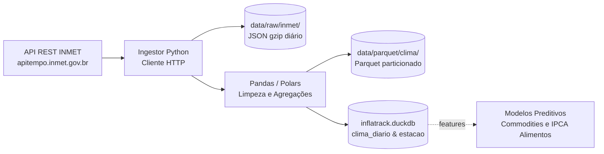

# Pipeline de Dados — Dados do Clima Diário (INMET)

Esta seção detalha o fluxo de dados meteorológicos diários coletados pela rede de estações do Instituto Nacional de Meteorologia (INMET), integrados para fornecer variáveis de choques climáticos aos modelos de preços agrícolas e de alimentos.

## Visão Geral da Arquitetura

O pipeline implementa um fluxo ELT contínuo diário. As medições diárias consolidadas das centenas de estações meteorológicas são extraídas via API REST pública do INMET, aterrissadas em formato JSON comprimido na camada raw, tratadas e convertidas para Parquet particionado na camada Silver, e finalmente consolidadas no **DuckDB** analítico unificado (`inflatrack.duckdb`).

---

## Etapas do Pipeline

| # | Etapa | Frequência | Descrição | Status |
|---|---|---|---|---|
| 1 | Sincronização Cadastral de Estações | Eventual (mensal) | Atualização dos metadados e coordenadas de ~670 estações na dimensão `estacao_meteorologica` | Documentado |
| 2 | Coleta Diária e Aterrissagem (Raw) | Diária | Requisições HTTP REST aos dados das estações ativas e gravação em `.json.gz` | Documentado |
| 3 | Normalização e Imputação (Silver) | Diária | Validação de tipos, interpolação de lacunas pontuais e gravação em Parquet | Documentado |
| 4 | Carga Analítica Idempotente (Gold) | Diária | `UPSERT` por `(estacao_id, data_referencia)` na tabela `clima_diario` do DuckDB | Documentado |
| 5 | Engenharia de Features Climáticas | Em lote (treino de ML) | Cálculo de acumulados de chuva (30/60/90 dias) e anomalias de temperatura por polo agrícola | Planejado |

### 1. Sincronização Cadastral de Estações

- Consulta ao catálogo de estações do INMET (`https://apitempo.inmet.gov.br/estacoes/T`), capturando `CD_ESTACAO`, nome do município, UF, coordenadas geográficas (latitude/longitude), altitude e tipo da estação (`Automatica` ou `Convencional`).
- Popula e atualiza a dimensão cadastral `estacao_meteorologica`.

### 2. Coleta Diária e Aterrissagem (Raw)

- Coleta automatizada das medições consolidadas do dia anterior.
- Armazenamento em arquivos diários compactados em `data/raw/inmet/clima_YYYY-MM-DD.json.gz` (~300 a 400 KB/dia).
- Garante total reprodutibilidade e conformidade de auditoria sem necessitar de novas chamadas à API governamental.

### 3. Normalização e Imputação (Silver)

- **Conversão de tipos de dados:** Garantia de tipagem de ponto flutuante (`FLOAT/DOUBLE`) para medições de temperatura (°C), precipitação pluviométrica (mm) e umidade relativa (%).
- **Tratamento de telemetria falha:** Quando sensores apresentam valores nulos (`null`), o pipeline sinaliza `observado = false` e aplica estimativas por interpolação espacial baseadas em estações vizinhas do mesmo estado ou bioma.
- **Materialização em Parquet:** Persistência em `data/parquet/clima/ano=YYYY/mes=MM/`, particionado para leitura analítica eficiente.

### 4. Carga Analítica Idempotente (Gold / DuckDB)

- O ingestor executa `UPSERT` via `INSERT ... ON CONFLICT (estacao_id, data_referencia) DO UPDATE` na tabela `clima_diario`.
- A adesão ao [ADR 0002](../adr/0002-duckdb-unico.md) permite cruzamento SQL imediato com `commodity_cotacao` (cotações de milho, trigo, açúcar, café) e `observacao` (IPCA Alimentos e Bebidas).

---

## Garantias de Engenharia

- **Idempotência por Chave Composta:** A restrição única `(estacao_id, data_referencia)` permite que o lote diário seja reexecutado múltiplas vezes sem risco de duplicatas.
- **Tolerância a Falhas na Rede Externa:** Cliente HTTP configurado com timeout de 30 segundos e retentativa exponencial com jitter para suportar instabilidades temporárias nos servidores do INMET.
- **Rastreabilidade de Imputação:** O campo booleano `observado` separa rigorosamente dados reais de sensores de telemetria daquelas medições reconstruídas por média regional.

---

## Como saber se falhou

- **Queda de cobertura:** Monitoramento de contagem de estações por dia: caso menos de 70% das estações ativas cadastradas retornem dados na rodada, é gerado alerta de degradação da telemetria.
- **Erros de API:** Respostas HTTP 5xx ou rejeições de conexão são capturadas, registrando log detalhado e mantendo as medições anteriores intactas no DuckDB.
