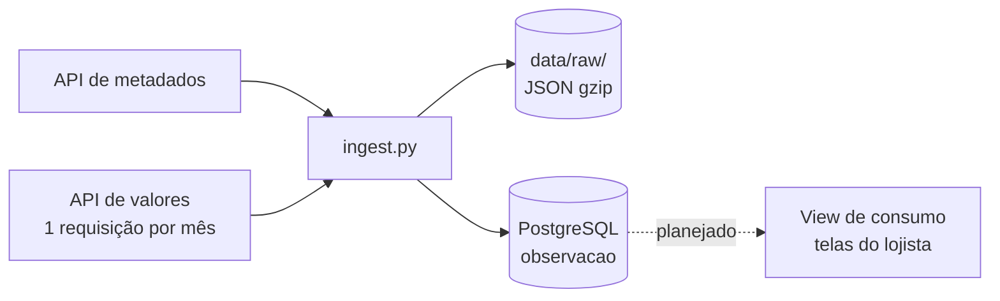

# Pipeline de Dados

Uma seção por fonte, na ordem em que o dado percorre o caminho: fonte → ingestão → armazenamento → transformação → consumo.

---

## IPCA e INPC (SIDRA/IBGE)

ELT em lote: a resposta da API é gravada crua e só depois transformada dentro do banco. Código em `src/inflatrack/sidra.py` (cliente da API) e `src/inflatrack/ingest.py` (carga).



### Etapas

| # | Etapa | Origem → Destino | Transformações | Frequência | Status |
|---|---|---|---|---|---|
| 1 | Sincronizar a cesta | API de metadados → `classificacao`, `classificacao_versao` | separar código e nome do rótulo (`"1101002.Arroz"`); derivar pai e nível pelo prefixo do código; montar o mapa `D4C` (id interno do SIDRA) → código natural | 1 vez por agregado a cada execução | Implementado |
| 2 | Carga histórica (jul/2006 – jul/2026) | API de valores (2938, 1419, 7060, 7063, 1737) → `data/raw/` e `observacao` | paginar por mês (teto de 50.000 valores); gravar o JSON cru em gzip; descartar marcadores de ausência (`...`, `..`, `-`, `X`) sem descartar negativos; traduzir `D4C`; `COPY` para tabela temporária e `INSERT ... ON CONFLICT DO NOTHING` | 1 vez, reexecutável | Implementado; validado só com amostra do 7060 (mai–jul/2026) |
| 3 | Atualização mensal | API de valores (7060, 7063, 1737) → `data/raw/` e `observacao` | as mesmas da etapa 2, só para o mês novo; valor revisado pelo IBGE entra como linha nova (insert-only) | mensal, após a divulgação (dias 9 a 12) | Manual — mesmo script com `--de`/`--ate`; agendamento não implementado |
| 4 | Publicação para consumo | `observacao` + `classificacao_versao` + `produto` → view materializada | resolver o nome vigente do subitem; usar a variável 2265 ou derivá-la da variação mensal conforme `tem_acum_12m`; juntar produto ao subitem | após cada carga mensal | Planejado |

### Garantias

- **Idempotência:** o índice único `observacao_versao_uk` inclui o valor, então reexecutar o mesmo mês não duplica linhas.
- **Commit por mês:** cada mês é uma transação; uma falha no meio da carga preserva os meses já gravados e basta reexecutar.
- **Retry:** na API de valores, até 4 tentativas com backoff exponencial em erro de rede; HTTP 400 (teto de valores estourado) aborta sem repetir.
- **Reprocessamento:** a camada crua permite refazer a transformação sem chamar a API de novo.

### Como saber se falhou

- O script sai com código 1 e registra `carga abortada` em erro da API ou do banco.
- `just verificar-carga` compara linhas por fonte com o volume medido (2938 ~798 mil, 1419 ~2,19 mi, 7060 ~1,71 mi) e lista fontes com mês faltando no meio da série. A comparação é manual: nenhum alerta automático ainda.
- Mês ainda não divulgado volta vazio, sem erro — por isso a conferência de volume é necessária.

### Como rodar

```bash
just reset           # sobe o Postgres e aplica as migrations
just seed-amostra    # 3 meses do 7060, confere a ingestão
just seed            # carga histórica completa (dezenas de minutos)
just verificar-carga
```

Um agregado e período específicos:

```bash
uv run python -m inflatrack.ingest --agregado 7060 --de 2026-08 --ate 2026-08
```
