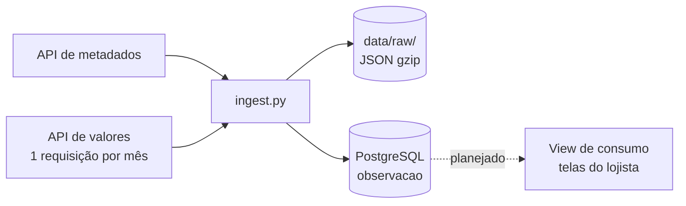

# Pipeline de Dados

Uma seção por fonte, na ordem em que o dado percorre o caminho: fonte → ingestão → armazenamento → transformação → consumo.

---

## IPCA e INPC (SIDRA/IBGE)

ELT em lote: a resposta da API é gravada crua e só depois transformada dentro do banco. Código em `src/inflatrack/sidra.py` (cliente da API) e `src/inflatrack/ingest.py` (carga).



### Etapas

| # | Etapa | Frequência | Status |
|---|---|---|---|
| 1 | Sincronizar a cesta | 1 vez por agregado a cada execução | Implementado |
| 2 | Carga histórica (jul/2006 – jul/2026) | 1 vez, reexecutável | Implementado; validado só com amostra do 7060 (mai–jul/2026) |
| 3 | Atualização mensal | mensal, após a divulgação (dias 9 a 12) | Manual; agendamento não implementado |
| 4 | Publicação para consumo | após cada carga mensal | Planejado |

**1. Sincronizar a cesta** — API de metadados → `classificacao` e `classificacao_versao`

- Separa código e nome do rótulo (`"1101002.Arroz"`).
- Deriva pai e nível pelo prefixo do código.
- Monta o mapa `D4C` (id interno do SIDRA) → código natural, usado na etapa 2.

**2. Carga histórica** — API de valores (2938, 1419, 7060, 7063, 1737) → `data/raw/` e `observacao`

- Pagina por mês (teto de 50.000 valores por requisição).
- Grava o JSON cru em gzip antes de transformar.
- Descarta marcadores de ausência (`...`, `..`, `-`, `X`) sem descartar negativos.
- Traduz `D4C` pelo mapa da etapa 1.
- `COPY` para tabela temporária e `INSERT ... ON CONFLICT DO NOTHING` na `observacao`.

**3. Atualização mensal** — API de valores (7060, 7063, 1737) → `data/raw/` e `observacao`

- Mesmo script da etapa 2, só com o mês novo em `--de`/`--ate`.
- Valor revisado pelo IBGE entra como linha nova (insert-only).

**4. Publicação para consumo** — `observacao` + `classificacao_versao` + `produto` → view materializada

- Resolve o nome vigente do subitem.
- Usa a variável 2265 ou a deriva da variação mensal, conforme `fonte_agregado.tem_acum_12m`.
- Junta o produto do lojista ao subitem.

### Garantias

- **Idempotência:** o índice único `observacao_versao_uk` inclui o valor, então reexecutar o mesmo mês não duplica linhas.
- **Commit por mês:** cada mês é uma transação; uma falha no meio da carga preserva os meses já gravados e basta reexecutar.
- **Retry:** na API de valores, até 4 tentativas com backoff exponencial em erro de rede; HTTP 400 (teto de valores estourado) aborta sem repetir.
- **Reprocessamento:** a camada crua permite refazer a transformação sem chamar a API de novo.

### Como saber se falhou

- O script sai com código 1 e registra `carga abortada` em erro da API ou do banco.
- `just verificar-carga` compara linhas por fonte com o volume medido (2938 ~798 mil, 1419 ~2,19 mi, 7060 ~1,71 mi) e lista fontes com mês faltando no meio da série. A comparação é manual: nenhum alerta automático ainda.
- Mês ainda não divulgado volta vazio, sem erro — por isso a conferência de volume é necessária.

### Como rodar

```bash
just reset           # sobe o Postgres e aplica as migrations
just seed-amostra    # 3 meses do 7060, confere a ingestão
just seed            # carga histórica completa (dezenas de minutos)
just verificar-carga
```

Um agregado e período específicos:

```bash
uv run python -m inflatrack.ingest --agregado 7060 --de 2026-08 --ate 2026-08
```
