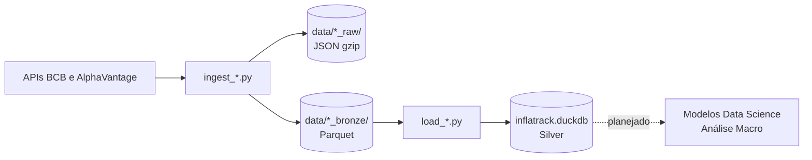

# Pipeline de Dados (Macroeconomia)

Esta seção detalha o fluxo de dados exclusivo para o módulo de Macroeconomia e Commodities, focado em alta performance analítica e Séries Temporais.

## Fontes (Dólar, Selic e AlphaVantage)

ETL analítico: as respostas das APIs financeiras aterrissam localmente, são limpas pelo `pandas` (com Forward Fill) e injetadas no banco de colunas (DuckDB). O código vive nas suítes `ingest_*.py` e `load_*.py`.



### Etapas

| # | Etapa | Frequência | Status |
|---|---|---|---|
| 1 | Extração e Aterrissagem (RAW) | Diária | Implementado |
| 2 | Tratamento Temporal (Bronze) | Diária (Pandas `ffill`) | Implementado |
| 3 | Carga Idempotente (Silver / DuckDB) | Diária (UPSERT) | Implementado |

**1. Extração e Aterrissagem (RAW)**
- `dolar_olinda.py` e `selic_sgs.py` formatam as datas para o padrão das APIs.
- O payload é descarregado intocado em `json.gz` para auditoria, preservando a assinatura original do governo/provedor.

**2. Tratamento Temporal (Bronze)**
- Remoção intradiária: O Pandas aplica `keep="last"` para ignorar boletins parciais do dia e manter apenas a cotação de fechamento oficial.
- **Forward Fill:** A cotação da sexta-feira é duplicada para Sábado, Domingo e Feriados.
- Os dados tratados viram blocos `.parquet`.

**3. Carga Idempotente (Silver)**
- Scripts `load_*.py` conectam ao `DuckDB`.
- Operação com a cláusula `ON CONFLICT DO UPDATE`.

### Garantias

- **Idempotência Matemática:** Graças à chave primária de data e o `ON CONFLICT`, o script pode ser executado centenas de vezes sobre o mesmo período sem gerar linhas duplicadas.
- **Continuidade do Calendário:** O *Forward Fill* garante que não existirão "buracos" no cruzamento com a base de vendas do lojista (que opera nos finais de semana).
- **Cobertura de Testes:** A lógica de formatação de parâmetros das APIs está coberta por testes automatizados (`pytest` via `unittest.mock`) blindando contra mudanças inesperadas.

### Como saber se falhou

- O script acusa erro 403 (`requests.exceptions.HTTPError`) caso o IP seja bloqueado pelo WAF do Banco Central.
- A função de `load_*.py` falhará graciosamente imprimindo `Erro ao carregar` mas sem corromper as linhas já processadas, graças ao modelo transacional isolado do arquivo `.parquet`.

### Como rodar

O orquestrador `justfile` foi configurado para disparar toda a cadeia analítica.

```bash
just seed-macro         # Roda Dólar, Selic e Commodities em sequência
just seed-dolar         # Roda exclusivamente o Dólar
just seed-selic         # Roda exclusivamente a Selic
```
