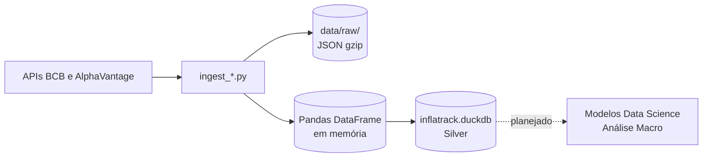

# Pipeline de Dados (Macroeconomia)

Esta seção detalha o fluxo de dados exclusivo para o módulo de Macroeconomia e Commodities, focado em alta performance analítica e Séries Temporais.

## Fontes (Dólar, Selic e AlphaVantage)

ETL analítico: as respostas das APIs financeiras aterrissam localmente, são limpas pelo `pandas` (com Forward Fill) e injetadas no banco de colunas (DuckDB). O código está consolidado nos scripts `ingest_*.py`.


```mermaid
flowchart LR
    A[APIs BCB e AlphaVantage] --> B[ingest_*.py]
    B --> C[(data/raw/<br/>JSON gzip)]
    B --> D[(Pandas DataFrame<br/>em memória)]
    D --> F[(inflatrack.duckdb<br/>Silver)]
    F -. planejado .-> G[Modelos Data Science<br/>Análise Macro]
```

### Etapas

| # | Etapa | Frequência | Status |
|---|---|---|---|
| 1 | Extração e Aterrissagem (RAW) | Diária | Implementado |
| 2 | Tratamento Temporal (Bronze) | Diária (Pandas `ffill`) | Implementado |
| 3 | Carga Idempotente (Silver / DuckDB) | Diária (UPSERT) | Implementado |

**1. Extração e Aterrissagem (RAW)**
- `ingest_dolar.py` e `ingest_selic.py` formatam as datas para o padrão de cada API.
- As observações retornadas são gravadas sem alteração em `json.gz` antes da transformação.

**2. Tratamento Temporal (Bronze)**
- Deduplicação defensiva: se houver mais de uma linha na data, o Pandas ordena `dataHoraCotacao` e mantém a última.
- **Forward Fill:** O último valor útil conhecido é carregado para sábados, domingos e feriados; `observado = false` identifica essas linhas.
- Os dados são passados diretamente em memória para a carga Silver.

**3. Carga Idempotente (Silver)**
- Os mesmos scripts `ingest_*.py` conectam ao `DuckDB`.
- Operação com a cláusula `ON CONFLICT DO UPDATE`.

### Garantias

- **Idempotência Matemática:** Graças à chave primária de data e o `ON CONFLICT`, o script pode ser executado centenas de vezes sobre o mesmo período sem gerar linhas duplicadas.
- **Continuidade do Calendário:** O *forward fill* cobre toda a janela solicitada, inclusive quando ela começa em feriado ou fim de semana, usando dez dias de histórico anterior.
- **Rastreabilidade:** `observado` permite separar valores publicados dos carregados para alinhamento.
- **Cobertura de Testes:** Clientes HTTP, transformação temporal e UPSERT idempotente são cobertos por testes automatizados.

### Como saber se falhou

- Erros HTTP, payloads inesperados, datas inválidas e falhas do DuckDB encerram o processo com código diferente de zero.
- Uma resposta vazia não é tratada como sucesso.

### Como rodar

O orquestrador `justfile` foi configurado para disparar toda a cadeia analítica.

```bash
just seed-macro         # Roda Dólar, Selic e Commodities em sequência
just seed-dolar         # Roda exclusivamente o Dólar
just seed-selic         # Roda exclusivamente a Selic
```
