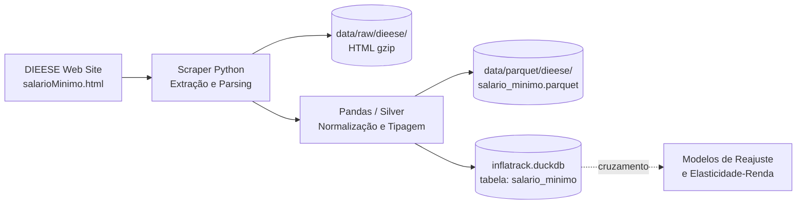

# Pipeline de Dados — Salário Mínimo e Cesta Básica (DIEESE)

Esta seção detalha o fluxo de dados do salário mínimo nominal e necessário da Pesquisa Nacional da Cesta Básica de Alimentos, divulgada mensalmente pelo DIEESE.

## Visão Geral da Arquitetura

O pipeline segue a estratégia ELT com preservação da camada crua: a página HTML oficial do DIEESE é baixada por raspagem (*web scraping*), arquivada em formato comprimido original, convertida em DataFrame estruturado (camada Silver em Parquet) e carregada via `UPSERT` idempotente na base analítica colunar compartilhada (**DuckDB**).

---

## Etapas do Pipeline

| # | Etapa | Frequência | Descrição | Status |
|---|---|---|---|---|
| 1 | Extração e Aterrissagem (Raw) | Mensal | Requisição HTTP e armazenamento do HTML integral em `.html.gz` | Documentado |
| 2 | Limpeza e Tipagem (Silver) | Mensal | Parsing da tabela HTML, conversão monetária e geração de Parquet | Documentado |
| 3 | Carga Analítica (Gold / DuckDB) | Mensal | `UPSERT` idempotente por `ano_mes` na tabela `salario_minimo` | Documentado |
| 4 | Derivação de Features de Consumo | Sob demanda | Cálculo de poder de compra real e cruzamento com IPCA | Planejado |

### 1. Extração e Aterrissagem (Raw)

- **Requisição HTTP defensiva:** Conexão com `https://www.dieese.org.br/analisecestabasica/salarioMinimo.html` utilizando decodificação explícita `ISO-8859-1` (codificação nativa do servidor do DIEESE) para preservar acentuações dos meses.
- **Persistência íntegra:** O documento HTML completo é compactado com `gzip` e salvo em `data/raw/dieese/salario_minimo_YYYYMM.html.gz` para fins de auditoria, histórico regulatório e reprocessamento local.

### 2. Limpeza e Tipagem (Silver)

- **Parsing estruturado da tabela:** Extração do elemento `<table rules="all">`. O algoritmo percorre as linhas rastreando as quebras de ano identificadas por `<tr class="subtitulo">` e associando cada linha de mês ao ano vigente.
- **Padronização temporal:** O nome textual do mês em português (ex: "Janeiro", "Março") é convertido para formato numérico de 2 dígitos e composto com o ano (`YYYY-MM`), derivando também a data canônica (`data_referencia = YYYY-MM-01`).
- **Higienização de valores monetários:** Remoção de prefixos `"R$"`, eliminação de pontos de milhar e substituição de vírgula por ponto decimal (`"R$ 1.621,00"` → `1621.00`).
- **Engenharia de atributos:** Cálculo da razão instantânea `multiplo_necessario_nominal = salario_necessario / salario_nominal`.
- **Armazenamento colunar:** O resultado processado é salvo em `data/parquet/dieese/salario_minimo.parquet`.

### 3. Carga Analítica (Gold / DuckDB)

- O ingestor conecta ao banco analítico embutido `data/duckdb/inflatrack.duckdb` (em conformidade com o [ADR 0002](../adr/0002-duckdb-unico.md)).
- Executa `INSERT ... ON CONFLICT (ano_mes) DO UPDATE`, garantindo idempotência total.

---

## Garantias de Engenharia

- **Idempotência Temporal:** A chave primária `ano_mes` impede a duplicação de medições históricas, permitindo reexecutar o pipeline repetidamente sem inconsistências.
- **Reprocessabilidade Offline:** Caso a lógica de cálculo ou normalização seja atualizada, o processamento pode ser refeito do zero relendo os arquivos `.html.gz` da camada raw, sem gerar tráfego adicional aos servidores do DIEESE.
- **Tratamento de Caracteres Especiais:** Decodificação estrita de `ISO-8859-1` previne quebras nos meses com caracteres especiais (como "Março").

---

## Como saber se falhou

- **Layout modificado:** Se o DIEESE alterar a estrutura HTML (tags, classes de subtítulo ou colunas), o parser lança exceção com código de erro diferente de zero, abortando a carga.
- **Validação de monotonicidade:** Checagem pós-carga verificando que a série mensal histórica não apresenta lacunas temporais entre julho de 1994 e o mês corrente.
